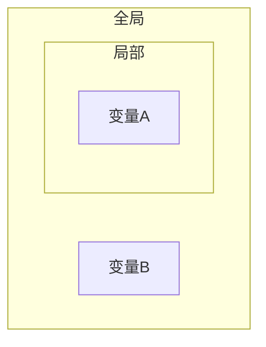
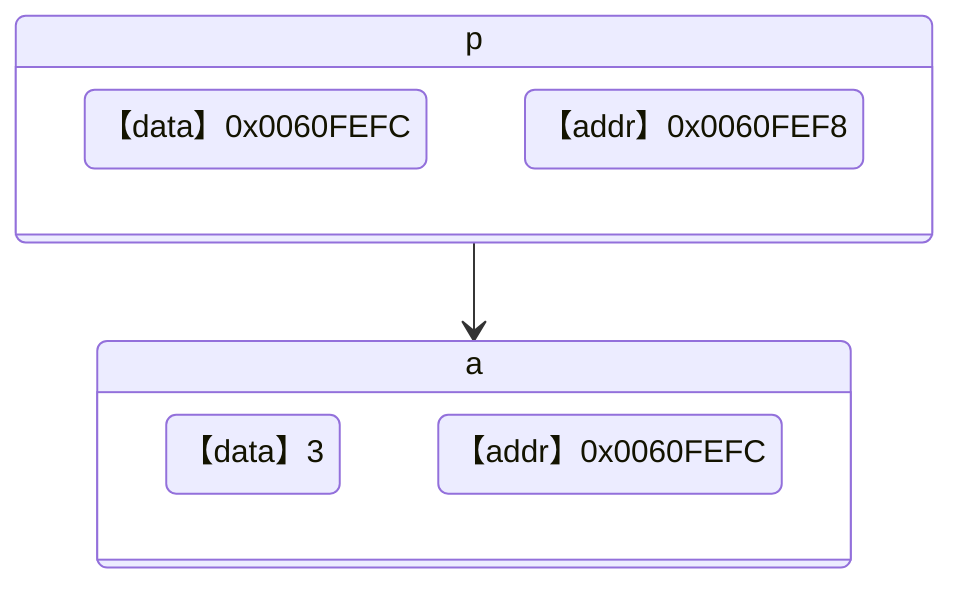
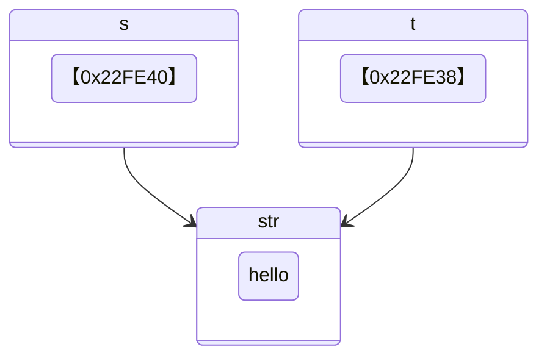
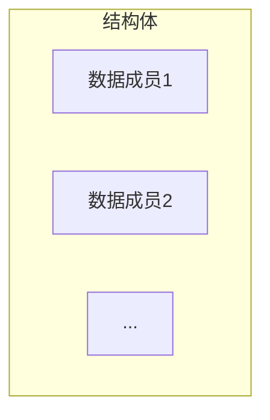
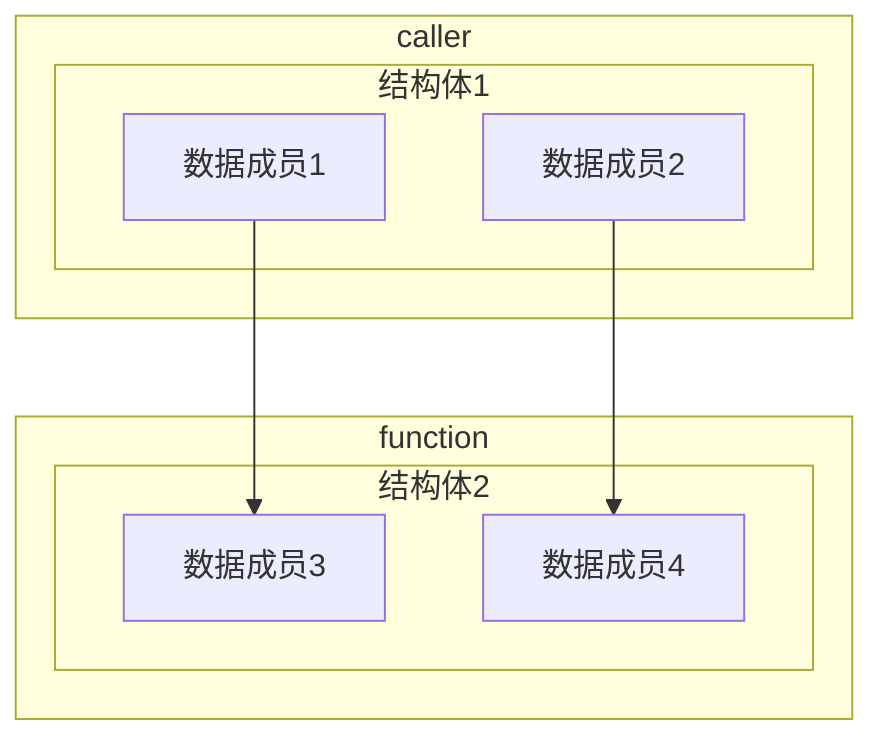

# 第6章 函数

## 6.1 函数

**函数（Function）**

函数执行一个特定的任务，每个C程序都至少有一个函数`main()`。C标准库提供了大量内置函数，例如`strlen()`用来计算字符串的长度、`printf()`用来进行格式化输出等。


当调用函数时，程序控制权会转移给被调用的函数，当函数执行结束后，函数会把程序序控制权交还给其调用者。

```mermaid
graph TB
	subgraph Callee
		code2 --> code3
	end

	subgraph Caller
		code1 --> call
		call --> code5
	end
	
	call --> code2
	code3 --> call
```


**函数声明与定义**

函数声明时需要告诉编译器函数的名称、返回类型和参数。在函数声明时，参数的名称可以省略，但是参数的类型是必须的。

```c
data_type function_name(parameter_list);
```

函数的参数列表包括参数的类型、顺序、数量等信息，参数列表可以为空。

函数可以返回一个值，函数的返回类型为被返回的值的类型。函数也可以不返回任何值，此时函数的返回类型应定义为`void`。

```c
data_type function_name(parameter_list) {
    // code
}
```


**函数设计方法**

为什么不把所有的代码全部写在`main()`中，还需要自定义函数呢？

使用函数有以下好处：

1. 避免代码复制，代码复制是程序质量不良的表现
2. 便于代码维护
3. 避免重复造轮子，提高开发效率

在设计函数的时候需要考虑以下的几点要素：

1. 确定函数的功能
2. 确定函数的参数
    - 是否需要参数
    - 参数个数
    - 参数类型
3. 确定函数的返回值
    - 是否需要返回值
    - 返回值类型

---

【代码】函数实现返回最大值

```c
#include <stdio.h>

// 函数原型
int max(int num1, int num2);

int main() {
    printf("%d\n", max(4, 12));
    printf("%d\n", max(54, 33));
    printf("%d\n", max(0, -12));
    printf("%d\n", max(-999, -774));
    return 0;
}

// 函数实现
int max(int num1, int num2) {
    // if(num1 > num2) {
    //     return num1;
    // } else {
    //     return num2;
    // }
    return num1 > num2 ? num1 : num2;
}
```

> 运行结果

```
12
54
0
-774
```

---

【代码】函数实现累加和

```c
#include <stdio.h>

int sum(int start, int end) {
    int total = 0;
    for(int i = start; i <= end; i++) {
        total += i;
    }
    return total;
}

int main() {
    printf("1-100的累加和 = %d\n", sum(1, 100));
    printf("1024-2048的累加和 = %d\n", sum(1024, 2048));
    return 0;
}
```

> 运行结果

```
1-100的累加和 = 5050
1024-2048的累加和 = 1574400
```

---

【代码】函数实现输出i行j列由自定义字符组成的图案

```c
#include <stdio.h>

void printChars(int row, int col, char c) {
    for(int i = 0; i < row; i++) {
        for(int j = 0; j < col; j++) {
            printf("%c", c);
        }
        printf("\n");
    }
}

int main() {
    printChars(5, 10, '?');
    return 0;
}
```

> 运行结果

```
??????????
??????????
??????????
??????????
??????????
```

---

【代码】自定义函数实现strlen()

```c
#include <stdio.h>

/**
 * @brief  自定义计算字符串长度函数
 * @param  str[]: 待计算字符串
 * @retval 字符串长度
 */
int myStrlen(char str[]) {
    int i = 0;
    while(str[i] != '\0') {
        i++;
    }
    return i;
}

int main() {
    char str[32] = "hello world";
    printf("字符串长度 = %d\n", myStrlen(str));
    return 0;
}
```

> 运行结果

```
字符串长度 = 11
```

---

【代码】自定义函数实现strcpy()

```c
#include <stdio.h>

/**
 * @brief  自定义字符串复制函数
 * @param  dst[]: 目标字符串
 * @param  src[]: 源字符串
 */
void myStrcpy(char dst[], char src[]) {
    int i = 0;
    while(src[i] != '\0') {
        dst[i] = src[i];
        i++;
    }
    dst[i] = '\0';
}

int main() {
    char s1[32] = "hello world";
    char s2[32] = "program";
    myStrcpy(s1, s2);
    printf("s1 = %s\n", s1);
    printf("s2 = %s\n", s2);
    return 0;
}
```

> 运行结果

```
s1 = program
s2 = program
```

---

【代码】自定义函数实现strcat()

```c
#include <stdio.h>

/**
 * @brief  自定义字符串拼接函数
 * @param  dst[]: 目标字符串
 * @param  src[]: 源字符串
 */
void myStrcat(char dst[], char src[]) {
    int i = 0;
    int j = 0;

    // 找到目标字符串尾部
    while(dst[i] != '\0') {
        i++;
    }
    while(src[j] != '\0') {
        dst[i++] = src[j++];
    }
    dst[i] = '\0';
}

int main() {
    char s1[32] = "hello";
    char s2[32] = "world";

    myStrcat(s1, s2);
    printf("s1 = %s\n", s1);
    printf("s2 = %s\n", s2);
    return 0;
}
```

> 运行结果

```
s1 = helloworld
s2 = world
```

---

<div style="page-break-after: always;"></div>

## 6.2 局部变量与全局变量

**局部变量（Local Varaible）**

定义在块内的变量就是本地变量，在进入块之前，其中的变量不存在，离开块，变量则释放。在一个块内不能定义同名的变量，并且本地变量不会被默认初始化。

本地变量的生存周期从声明时开始到所在块结束消亡，其作用域为所在的块中。

在函数中，函数的每次调用就会产生一个独立的空间，在这个空间中的变量，是函数的这次运行所独有的，函数的参数也是本地变量。

---

【代码】局部变量

```c
#include <stdio.h>

int main() {
    int a = 1;
    printf("a = %d\n", a);
    {
        int a = 2;
        printf("a = %d\n", a);
    }
    printf("a = %d\n", a);
    return 0;
}
```

> 运行结果

```
a = 1
a = 2
a = 1
```

---


**全局变量（Global Varaible）**

全局变量可以在程序任何地方创建，可以被本程序所有对象或函数引用。但是全局变量会占用更多的内存（因为其生命周期长），使用全局变量程序运行时速度更快一些（因为内存不需要再分配）。

全局变量的优先级低于局部变量，当全局变量与局部变量重名的时候，起作用的是局部变量，全局变量会被暂时屏蔽掉。



---

【代码】全局变量

```c
#include <stdio.h>

int a = 1;      // 全局变量

int main() {
    int a = 2;  // 本地变量
    printf("a = %d\n", a);
    return 0;
}
```

> 运行结果

```
a = 2
```

---

<div style="page-break-after: always;"></div>

## 6.3 递归

**递归（Recursion）**

要理解递归，先得理解递归（见6.3章节）。

在函数的内部，直接或者间接的调用自己的过程就叫作递归。对于一些问题，使用递归可以简洁易懂的解决问题，但是递归的缺点是性能低，占用大量系统栈空间。

递归算法很多时候可以处理一些特别复杂、难以直接解决的问题。

比如：

- 迷宫
- 汉诺塔
- 八皇后
- 排序
- 搜索

在定义递归函数时，一定要确定一个结束条件，否则会造成无限递归的情况，最终会导致栈溢出。


---

【代码】无限递归

```c
#include <stdio.h>

void tellStory() {
    printf("从前有座山\n");
    printf("山里有座庙\n");
    printf("庙里有个老和尚和小和尚\n");
    printf("老和尚在对小和尚讲故事\n");
    printf("他讲的故事是：\n");
    tellStory();
}

int main() {
    tellStory();
    return 0;
}
```

> 运行结果

```
从前有座山
山里有座庙
庙里有个老和尚和小和尚
老和尚对小和尚在讲故事
他讲的故事是：
从前有座山
山里有座庙
庙里有个老和尚和小和尚
老和尚对小和尚在讲故事
他讲的故事是：
...
```

---

递归函数一般需要定义递归的出口，即结束条件，确保递归能够在适合的地方退出。

---

【代码】阶乘

```c
#include <stdio.h>

int factorial(int n) {
    if(n == 0 || n == 1) {
        return 1;
    }
    return n * factorial(n-1);
}

int main() {
    printf("5! = %d\n", factorial(5));
    return 0;
}
```

> 运行结果

```
5! = 120
```


---

【代码】斐波那契数列（递归）

```c
#include <stdio.h>

int fibonacci(int n) {
    if(n == 1 || n == 2) {
        return 1;
    }
    return fibonacci(n-2) + fibonacci(n-1);
}

int main() {
    int n = 7;
    printf("斐波那契数列第%d位：%d\n", n, fibonacci(n));
    return 0;
}
```

> 运行结果

```
斐波那契数列第7位：13
```


---

【代码】斐波那契数列（迭代）

```c
#include <stdio.h>

int fibonacci(int n) {
    int f[n];
    f[0] = f[1] = 1;
    for(int i = 2; i < n; i++) {
        f[i] = f[i-2] + f[i-1];
    }
    return f[n-1];
}

int main() {
    int n = 7;
    printf("斐波那契数列第%d位：%d\n", n, fibonacci(n));
    return 0;
}
```

> 运行结果

```
斐波那契数列第7位：13
```

---

【代码】阿克曼函数
$$
A(m, n) =
\begin{cases}
	n + 1 & m = 0 \\
	A(m-1, 1) & m > 0, n = 0 \\
	A(m-1, A(m, n-1)) & m > 0, n > 0 \\
\end{cases}
$$

```c
#include <stdio.h>

int A(int m, int n) {
    if(m == 0) {
        return n + 1;
    } else if(m > 0 && n == 0) {
        return A(m-1, 1);
    } else if(m > 0 && n > 0) {
        return A(m-1, A(m, n-1));
    }
}

int main() {
    printf("%d\n", A(3, 4));
    return 0;
}
```

> 运行结果

```
125
```

|  m\n  |      0      |         1         |         2         |            3            |         4         |                           n                            |
| :---: | :---------: | :---------------: | :---------------: | :---------------------: | :---------------: | :----------------------------------------------------: |
| **0** |      1      |         2         |         3         |            4            |         5         |                       $ n + 1 $                        |
| **1** |      2      |         3         |         4         |            5            |         6         |                  $ 2 + (n + 3) - 3 $                   |
| **2** |      3      |         5         |         7         |            9            |        11         |                    $ 2(n + 3) - 3 $                    |
| **3** |      5      |        13         |        29         |           61            |        125        |                   $ 2^{n + 3} - 3 $                    |
| **4** |     13      |       65533       | $ 2^{65536} - 3 $ | $ A(3, 2^{65536} - 3) $ | $ A(3, A(4, 3)) $ | $ \underbrace{2^{2^{.^{.^{.{^2}}}}}}_{n+3\ twos} - 3 $ |
| **5** |    65533    |  $ A(4, 65533) $  | $ A(4, A(5, 1)) $ |    $ A(4, A(5, 2)) $    | $ A(4, A(5, 3)) $ |                       $ \dots $                        |
| **6** | $ A(5, 1) $ | $ A(5, A(5, 1)) $ | $ A(5, A(6, 1)) $ |    $ A(5, A(6, 2)) $    | $ A(5, A(6, 3)) $ |                       $ \dots $                        |


---

【代码】汉诺塔

给定三根柱子，其中A柱子从大到小套有n个圆盘，问题是如何借助B柱子，将圆盘从A搬到C。

> 规则：
>
> - 一次只能搬动一个圆盘
> - 不能将大圆盘放在小圆盘上面


递归算法求解汉诺塔问题：

1. 将前n-1个圆盘从A柱借助于C柱搬到B柱。
2. 将最后一个圆盘直接从A柱搬到C柱。
3. 将n-1个圆盘从B柱借助于A柱搬到C柱。

```c
#include <stdio.h>

int move = 0;       // 移动次数

/**
 * @brief  汉诺塔算法
 * @note   把 n 个盘子从 src 借助 mid 移到 dst
 * @param  n: 层数
 * @param  src: 起点柱子
 * @param  mid: 临时柱子
 * @param  dst: 目标柱子
 */
void hanoi(int n, char src, char mid, char dst) {
    if(n == 1) {
        printf("%d号盘：%c -> %c\n", n, src, dst);
        move++;
    } else {
        // 把前 n-1 个盘子从 src 借助 dst 移到 mid
        hanoi(n-1, src, dst, mid);
        // 移动第 n 个盘子
        printf("%d号盘：%c -> %c\n", n, src, dst);
        move++;
        // 把刚才的 n-1 个盘子从 mid 借助 src 移到 dst
        hanoi(n-1, mid, src, dst);
    }
}

int main() {
    hanoi(4, 'A', 'B', 'C');
    printf("步数 ==> %d\n", move);
    return 0;
}
```

> 运行结果

```
1号盘：A -> B
2号盘：A -> C
1号盘：B -> C
3号盘：A -> B
1号盘：C -> A
2号盘：C -> B
1号盘：A -> B
4号盘：A -> C
1号盘：B -> C
2号盘：B -> A
1号盘：C -> A
3号盘：B -> C
1号盘：A -> B
2号盘：A -> C
1号盘：B -> C
步数 ==> 15
```

---

<div style="page-break-after: always;"></div>

# 第7章 指针

## 7.1 指针

**指针（Pointer）**

指针是一个变量，用来保存另一个变量的地址。指针与其它变量或常量一样，在使用指针之前需使用`*`指定一个变量是指针类型。

```c
data_type *pointer_name;
```

通过取地址运算符`&`可以获取变量在内存中的地址。

---

【代码】指针

```c
#include <stdio.h>

int main() {
    int a;
    int *p = &a;

    printf("变量a的地址：%p\n", &a);
    printf("指针p保存的值：%p\n", p);
    printf("指针p的地址：%p\n", &p);
    return 0;
}
```

> 运行结果

```
变量a的地址：0060FEFC
指针p保存的值：0060FEFC
指针p的地址：0060FEF8
```



---


**取内容运算符**

取内容运算符`*`是一个单目运算符，用来访问指针所指向地址上的值。

---

【代码】通过指针修改变量的值

```c
#include <stdio.h>

int main() {
    int a = 1;
    int *p = &a;

    printf("指针p所指向的地址上的值：%d\n", *p);
    *p = 2;
    printf("指针p所指向的地址上的值：%d\n", *p);
    return 0;
}
```

> 运行结果

```
指针p所指向的地址上的值：1
指针p所指向的地址上的值：2
```

---

取地址运算符`&`与取内容运算符`*`起相反作用：

- *&p == *(&p) ==p
- &\*p == &(\*p) == p


**应用场景**

为什么要多此一举通过指针修改变量的值？

由于函数只能由一个返回值，如果当函数需要返回多个值时，某些值就只能通过指针进行返回。

---

【代码】交换两个变量的值（Bug版本）

```c
#include <stdio.h>

void swap(int num1, int num2) {
    int temp = num1;
    num1 = num2;
    num2 = temp;
}

int main() {
    int a = 11;
    int b = 22;

    printf("交换前：a = %d, b = %d\n", a, b);
    swap(a, b);
    printf("交换后：a = %d, b = %d\n", a, b);
    return 0;
}
```

> 运行结果

```
交换前：a = 11, b = 22
交换后：a = 11, b = 22
```

---

【代码】交换两个变量的值（正确版本）

```c
#include <stdio.h>

void swap(int *num1, int *num2) {
    int temp = *num1;
    *num1 = *num2;
    *num2 = temp;
}

int main() {
    int a = 11;
    int b = 22;

    printf("交换前：a = %d, b = %d\n", a, b);
    swap(&a, &b);
    printf("交换后：a = %d, b = %d\n", a, b);
    return 0;
}
```

> 运行结果

```
交换前：a = 11, b = 22
交换后：a = 22, b = 11
```

---


**野指针**

使用指针时最常见的错误就是声明了指针变量，但还没有指向任何变量，就开始使用指针。

---

【代码】野指针

```c
#include <stdio.h>

int main() {
    int *p;
    printf("%d\n", *p);
    return 0;
}
```

> 运行结果

```
warning: 'p' is used uninitialized in this function [-Wuninitialized]
```

---

在变量声明的时候，如果没有确切的地址可以赋值，为指针变量赋一个`NULL`值是一个良好的编程习惯。赋为`NULL`值的指针被称为空指针。`NULL`指针是一个定义在标准库中的值为零的常量。

```c
#define NULL 0
```

---

【代码】空指针NULL

```c
#include <stdio.h>

int main() {
    int *p = NULL;
    printf("%p\n", p);
    return 0;
}
```

> 运行结果

```
000000
```

---

<div style="page-break-after: always;"></div>

## 7.2 指针与数组

**指针与数组**

数组变量本身就表达地址，所以无需使用`&`取地址。

```c
int arr[10];
int *p = arr;
```

但是数组的每个单元表达的是变量，需要使用`&`取地址。

```c
int arr[10];
int *p = &arr[0];
```

---

【代码】指针遍历数组

```c
#include <stdio.h>

int main() {
    int arr[] = {44, 12, 64, 78, 16, 72, 13, 98, 84};
    int n = sizeof(arr) / sizeof(arr[0]);
    int *p = arr;

    while(p < arr + n) {
        printf("%d ", *p);
        p++;
    }
    printf("\n");
    return 0;
}
```

> 运行结果

```
44 12 64 78 16 72 13 98 84
```

---


**数组与函数**

在将数组作为函数参数传递的时候，在函数参数列表中的数组实际上是一个指向数组首地址的指针。

以下两种函数声明是等价的：

```c
int func(int *arr);
int func(int arr[]);
```

---

【代码】查找数组最大值

```c
#include <stdio.h>

int getMax(int *arr, int n) {
    int max = arr[0];
    for(int i = 1; i < n; i++) {
        if(arr[i] > max) {
            max = arr[i];
        }
    }
    return max;
}

int main() {
    int arr[] = {76, 23, 12, 98, 5, 61, 30};
    int n = sizeof(arr) / sizeof(arr[0]);
    int max = getMax(arr, n);
    printf("max = %d\n" , max);
    return 0;
}
```

> 运行结果

```
max = 98
```

---

<div style="page-break-after: always;"></div>

## 7.3 指针与字符串

**指针与字符串**

指针还可以指向一个字符串常量，但是试图通过指针所指的字符串做`写`操作会导致程序崩溃。

---

【代码】修改字符串常量

```c
#include <stdio.h>

int main() {
    char *s = "hello";
    s[0] = 'H';
    printf("%s\n", s);
    return 0;
}
```

> 运行结果

```
出现了一个问题，导致程序停止正常工作。请关闭该程序。
```

---

因此，如果需要对字符串进行修改，应该用字符数组的形式。

---

【代码】修改字符串

```c
#include <stdio.h>

int main() {
    char s[] = "hello";
    s[0] = 'H';
    printf("%s\n", s);
    return 0;
}
```

> 运行结果

```
Hello
```

---

在对一个指向字符串的指针进行赋值操作的时候，并没有产生新的字符串，只是让两个指针都指向该字符串，对其中任意一个指针做的操作都会对另一个指针产生影响。

---

【代码】指向字符串的指针

```c
#include <stdio.h>

int main() {
    char str[] = "hello";
    char *s = str;
    char *t;

    t = s;
    s[0] = 'H';

    printf("指针s指向的字符串：%s\n", s);
    printf("指针t指向的字符串：%s\n", t);
    printf("指针s的地址：%p\n", &s);
    printf("指针t的地址：%p\n", &t);
    return 0;
}
```

> 运行结果

```
指针s指向的字符串：Hello
指针t指向的字符串：Hello
指针s的地址：0022FE40
指针t的地址：0022FE38
```



---

<div style="page-break-after: always;"></div>

## 7.4 动态内存申请

**malloc()**

`C99`支持声明数组时使用变量作为数组的大小。

```c
int n = 50;
int arr[n];
```

但是在`C99`之前的版本中，需要使用动态内存申请的方式进行数组空间的开辟。`malloc()`的功能是向系统申请指定的内存空间（以字节为单位），使用该函数需要包含头文件`stdlib.h`。

`malloc()`函数原型为：

```c
void* malloc(size_t size);
```

`malloc()`的返回值为`void *`类型，表示一个指向申请到的空间的首地址，是一个无类型的指针，开发者需要自行转换为自己需要的类型。如果`malloc()`申请内存失败，则会返回空指针`NULL`。

```c
data_type *ptr = (data_type *)malloc(sizeof(data_type) * size);
```

---

【代码】耗尽所有可申请到的内存空间

```c
#include <stdio.h>
#include <stdlib.h>

int main() {
    void *p;
    int cnt = 0;

    // 每次申请100MB的空间
    while((p = malloc(100 * 1024 * 1024))) {
        cnt++;
    }
    printf("一共分配了%dMB空间\n", cnt*100);
    return 0;
}
```

> 运行结果

```
一共分配了1900MB空间
```

---

通过`malloc()`申请来的空间是需要归还给操作系统的，否则程序长时间运行内存会逐渐下降。

通过`free()`可以把申请来的空间释放，但是有两点需要注意：

1. 只能释放通过`malloc()`申请得到的空间
2. 只能通过空间的首地址进行释放


---

【代码】动态申请内存空间

```c
#include <stdio.h>
#include <stdlib.h>

int main() {
    int n;
    printf("班级人数：");
    scanf("%d", &n);

    int *scores = (int *)malloc(sizeof(int) * n);
    if(!scores) {
        fprintf(stderr, "内存申请失败\n");
        exit(1);
    }

    int total = 0;
    for(int i = 0; i < n; i++) {
        printf("第%d个学生成绩：", i+1);
        scanf("%d", &scores[i]);
        total += scores[i];
    }

    printf("平均分：%.2f\n", 1.0 * total / n);
    free(scores);
    return 0;
}
```

> 运行结果

```
班级人数：5
第1个学生成绩：67
第2个学生成绩：98
第3个学生成绩：100
第4个学生成绩：53
第5个学生成绩：65
平均分：76.60
```

---

在函数中的定义的字符数组是局部变量，其作用域和生命周期仅在函数内有效，如果将其作为函数返回值返回，在函数外部无法访问到该变量的内容。

---

【代码】函数返回字符串（Bug版本）

```c
#include <stdio.h>
#include <stdlib.h>
#include <string.h>

/**
 * @brief  生成一段自我介绍
 * @param  name: 姓名
 * @param  age: 年龄
 * @retval 指定格式字符串：大家好，我叫{name}，今年{age}岁。
 */
char* generateInfo(char *name, int age) {
    char info[128] = "大家好，我叫";
    char age_str[8] = "";
    strcat(info, name);
    strcat(info, "，今年");
    // itoa()函数用于将整数转为字符串
    // 把age以10进制转换为字符串保存到age_str
    strcat(info, itoa(age, age_str, 10));
    strcat(info, "岁。");
    return info;
}

int main() {
    printf("%s\n", generateInfo("极夜酱", 17));
    return 0;
}
```

> 运行结果

```
warning: function returns address of local variable [-Wreturn-local-addr]
```

---

【代码】函数返回字符串（正确版本）

```c
#include <stdio.h>
#include <stdlib.h>
#include <string.h>

/**
 * @brief  生成一段自我介绍
 * @param  name: 姓名
 * @param  age: 年龄
 * @retval 指定格式字符串：大家好，我叫{name}，今年{age}岁。
 */
char* generateInfo(char *name, int age) {
    char *info = (char *)malloc(sizeof(char) * 128);
    if(!info) {
        return NULL;
    }
    char age_str[8] = "";
    strcpy(info, "大家好，我叫");
    strcat(info, name);
    strcat(info, "，今年");
    // itoa()函数用于将整数转为字符串
    // 把age以10进制转换为字符串保存到age_str
    strcat(info, itoa(age, age_str, 10));
    strcat(info, "岁。");
    return info;
}

int main() {
    printf("%s\n", generateInfo("极夜酱", 17));
    return 0;
}
```

> 运行结果

```
大家好，我叫极夜酱，今年17岁。
```

---


<div style="page-break-after: always;"></div>

# 第8章 文件

## 8.1 文件打开方式

**文件**

C具有操作文件的能力，比如对文件数据的添加、删除、修改等。为了统一对各种硬件的操作，不同的硬件设备也都被看作是文件进行管理。计算机中键盘是标准输入设备`stdin`，显示器是标准输出设备`stdout`。

C通过声明一个文件`FILE`类型的指针，可以对指针所指向的文件进行操作。

```c
FILE *fp;
```


**文件打开**

`fopen()`用于打开文件，函数原型为：

```c
FILE *fopen(const char *fname, const char *mode);
```

> - fname：需要被打开的文件名路径
>- mode：打开方式

| 打开方式 | 描述                                                         |
| :------: | :----------------------------------------------------------- |
|    r     | 以`只读`模式打开文本文件。文件必须存在，否则打开失败         |
|    w     | 以`只写`模式打开文本文件。如果文件不存在，则创建一个文件；如果文件存在，则情况文件内容 |
|    a     | 以`追加`模式打开文本文件。如果文件不存在，则创建一个文件；如果文件存在，则将写入的数据追加到文件末尾 |
|    r+    | 以`读+写`模式打开文件文件。文件必须存在，否则打开失败        |
|    w+    | 以`写+读`模式打开文件文件。如果文件不存在，则创建一个文件；如果文件存在，则清空文件内容 |
|    a+    | 以`追加+读`模式打开文件文件。如果文件不存在，则创建一个文件；如果文件存在，则将写入的数据追加到文件末尾 |
|    rb    | 以`只读`模式打开二进制文件                                   |
|    wb    | 以`只写`模式打开二进制文件                                   |
|    ab    | 以`追加`模式打开二进制文件                                   |
|   rb+    | 以`读+写`模式打开二进制文件                                  |
|   wb+    | 以`写+读`模式打开二进制文件                                  |
|   ab+    | 以`追加+读`模式打开二进制文件                                |

如果文件打开失败，`fopen()`则会返回空指针`NULL`。


**文件关闭**

在对文件操作结束后，需要使用`fclose()`将文件关闭。

```c
fclose(fp);
```

`fclose()`负责清空缓冲区，并释放文件指针。需要特别注意的是，在对文件执行写操作以后，并不会马上写入文件，而只是写入到了这个文件的输出缓冲区中。只有当输出缓冲区满了，或者执行了`fflush()`，或者执行了`fclose()`以后，或者程序结束，才会把输出缓冲区中的内容写入文件。

---

【代码】文件

```c
#include <stdio.h>
#include <stdlib.h>

int main() {
    FILE *fp = fopen("data.txt", "r");
    if(!fp) {
        fprintf(stderr, "File Open Failed\n");
        exit(1);
    }
    fclose(fp);
    return 0;
}
```

---

<div style="page-break-after: always;"></div>

## 8.2 文件读写

**fgetc()读字符**

`fgetc()`的功能是从文件读取一个字符。成功时，返回读到的字符（int类型）；失败或读到文件尾，返回`EOF（-1）`。

`fgetc()`函数原型：

```c
int fgetc(FILE *stream);
```

---

【代码】读取并输出指定文件内容

```c
#include <stdio.h>
#include <stdlib.h>

int main() {
    FILE *fp = fopen("data.txt", "r");
    if(!fp) {
        fprintf(stderr, "File Open Failed\n");
        exit(1);
    }

    char c;
    while((c = fgetc(fp)) != EOF) {
        printf("%c", c);
    }
    
    fclose(fp);
    return 0;
}
```

---

【代码】统计程序源代码的字符数和行数

```c
#include <stdio.h>
#include <stdlib.h>

int main() {
    FILE *fp = fopen("count_chars_and_lines.c", "r");
    if(!fp) {
        fprintf(stderr, "File Open Failed\n");
        exit(1);
    }

    char c;
    int charNum = 0;        // 字符数量
    int lineNum = 0;        // 行数

    while((c = fgetc(fp)) != EOF) {
        if(c == '\n') {
            lineNum++;
        } else {
            charNum++;
        }
    }

    printf("字符数：%d\n", charNum);
    printf("行  数：%d\n", lineNum);

    fclose(fp);
    return 0;
}
```

> 运行结果

```
字符数：513
行  数：27
```

---


**fputc()写字符**

`fputc()`的功能是将一个字符写入文件中。

`fputc()`函数原型：

```c
int fputc(int ch, FILE *stream);
```

---

【代码】将程序源代码输出到指定文件

```c
#include <stdio.h>
#include <stdlib.h>

int main() {
    FILE *fp1 = fopen("fputc.c", "r");
    FILE *fp2 = fopen("data.txt", "w");
    if(!fp1) {
        fprintf(stderr, "File Open Failed\n");
        exit(1);
    }

    char c;
    while((c = fgetc(fp1)) != EOF) {
        fputc(c, fp2);
    }

    fclose(fp1);
    fclose(fp2);
    return 0;
}
```

---


**fgets()读字符串**

`fgets()`的功能是从文件读取一个字符串。读取成功时，返回指向字符串的指针；读取失败时，返回`NULL`。

`fgets()`函数原型：

```c
char *fgets(char *str, int num, FILE *stream);
```

> - str：用于保存字符串的变量
>- num：最多读取字符数量，由于字符串结尾需要保留`\0`结束符，因此真正只能最多读取num-1个字符

---

【代码】读取并输出程序源代码内容

```c
#include <stdio.h>
#include <stdlib.h>

int main() {
    FILE *fp = fopen("fgets.c", "r");
    if(!fp) {
        fprintf(stderr, "File Open Failed\n");
        exit(1);
    }

    char line[128];
    while(fgets(line, sizeof(line), fp)) {
        printf("%s", line);
    }

    fclose(fp);
    return 0;
}
```

---


**fputs()写字符串**

`fputs()`的功能是将一个字符串写入文件中。

`fputs()`函数原型：

```c
int fputs(const char *str, FILE *stream);
```

---

【代码】将程序源代码输出到指定文件

```c
#include <stdio.h>
#include <stdlib.h>

int main() {
    FILE *fp1 = fopen("fputs.c", "r");
    FILE *fp2 = fopen("data.txt", "w");
    if(!fp1) {
        fprintf(stderr, "File Open Failed\n");
        exit(1);
    }

    char line[128];
    while(fgets(line, sizeof(line), fp1)) {
        fputs(line, fp2);
    }

    fclose(fp1);
    fclose(fp2);
    return 0;
}
```

---


**fprintf()格式化输出**

`fprintf()`使用方法与`printf()`类似，只是多增加了一个参数，用于指定输出流。

`fprintf()`函数原型：

```c
int fprintf(FILE *stream, const char *format, ...);
```

---

【代码】将数据格式化输出到指定文件

```c
#include <stdio.h>
#include <stdlib.h>

int main() {
    FILE *fp = fopen("data.txt", "w");
    char name[3][12] = {"极夜酱", "小灰", "小白"};
    int age[3] = {17, 22, 19};

    for(int i = 0; i < 3; i++) {
        fprintf(fp, "%s\t%d\n", name[i], age[i]);
    }
    
    fclose(fp);
    return 0;
}
```

> 【data.txt】文件内容

```
极夜酱	17
小灰	22
小白	19
```

---


**fscanf()格式化输入**

`fscanf()`的功能是按照指定格式从文件读取数据。读取成功时返回实际读取的数据个数，失败时返回`EOF`。

`fscanf()`函数原型：

```c
int fscanf(FILE *stream, const char *format, ...);
```

---

【代码】从指定文件读取指定格式数据

```c
#include <stdio.h>
#include <stdlib.h>

int main() {
    FILE *fp = fopen("data.txt", "r");
    if(!fp) {
        fprintf(stderr, "File Open Failed\n");
        exit(1);
    }
    
    char name[12];
    int age;
    
    while(fscanf(fp, "%s\t%d", name, &age) != EOF) {
        printf("%s\t%d\n", name, age);
    }

    fclose(fp);
    return 0;
}
```

> 运行结果

```
极夜酱  17
小灰   22
小白   19
```

---


**feof()检查文件结束**

`feof()`的功能是检查文件是否已经达到文件末尾位置，如果是就返回非零值（真）。

`feof()`函数原型：

```c
int feof(FILE *stream);
```

---

【代码】从通讯录文件中查找指定人名

```c
#include <stdio.h>
#include <stdlib.h>
#include <string.h>
#include <stdbool.h>

int main() {
    FILE *fp = fopen("data.txt", "r");
    if(!fp) {
        fprintf(stderr, "File Open Failed\n");
        exit(1);
    }

    char key[32];       // 需查找数据
    char name[32];
    int age;
    bool found = false; // 是否找到

    printf("查找姓名：");
    gets(key);

    while(!feof(fp)) {
        fscanf(fp, "%s\t%d", name, &age);
        if(strcmp(name, key) == 0) {
            printf("%s\t%d\n", name, age);
            found = true;
            break;
        }
    }

    if(!found) {
        printf("未找到【%s】的信息\n", key);
    }

    fclose(fp);
    return 0;
}
```

> 运行结果

```
查找姓名：小灰
小灰	22
```

---

<div style="page-break-after: always;"></div>

# 第9章 结构体

## 9.1 结构体

**结构体（Structure）**

C中，数组是一种允许存储多个相同类型数据项的结构。结构体是另一种用户自定义的数据类型，它允许存储不同类型的数据项。

结构体的声明可以使用关键字`struct`，结构体名一般首字母大写。结构体的声明以`;`结束。结构体的声明通常定义为全局变量，这样就可以被多个函数所使用的了。

```c
struct struct_name {
    data_type var_name1;
    data_type var_name2;
    ...
};
```



通常会将用于描述同一个事物的变量定义成结构体。

例如：

- 日期（年、月、日）
- 坐标（横坐标、纵坐标）
- 学生信息（姓名、年龄、学号、成绩）

定义结构体变量时，不能只使用结构体名，需要加上`struct`关键字。

通过成员运算符`.`可以访问一个结构体之中的成员变量。

---

【代码】结构体变量

```c
#include <stdio.h>

struct Date {
    int year;
    int month;
    int day;
};

int main() {
    struct Date date;
    date.year = 2021;
    date.month = 3;
    date.day = 12;

    printf("%d年%d月%d日\n", date.year, date.month, date.day);
    return 0;
}
```

> 运行结果

```
2021年3月12日
```

---

<div style="page-break-after: always;"></div>

## 9.2 typedef

**typedef**

关键字`typedef`可以用来给数据类型定义别名，通过使用`typedef`可以简化结构体的声明，不用每次都加上`struct`关键字了。

```c
typedef struct [struct_name] {
    data_type var_name1;
    data_type var_name2;
    ...
} struct_name;
```

---

【代码】typedef定义别名

```c
#include <stdio.h>

typedef struct Coordinate {
    double x;
    double y;
} Coordinate;

int main() {
    Coordinate coor;
    coor.x = 3.1;
    coor.y = 2.7;
    printf("(%.1f, %.1f)\n", coor.x, coor.y);
    return 0;
}
```

> 运行结果

```
(3.1, 2.7)
```

---

<div style="page-break-after: always;"></div>

## 9.3 结构体指针

**结构体指针**

与数组不同，结构体变量的名字并不是结构体变量的地址，必须使用取地址运算符`&`。

结构体也可以作为函数参数进行传递。如果是按值传递，那么在函数中会新创建一个结构体变量，并复制调用者的结构体的值。如果是按址传递，则需要传递结构体的指针。



C提供了一个间接引用运算符`->`，可以直接访问结构体指针所指的结构变量中的成员。

---

【代码】倒数

```c
#include <stdio.h>
#include <stdlib.h>

// 分数
typedef struct Fraction {
    int numerator;       // 分子
    int denominator;     // 分母
} Fraction;

/**
 * @brief  倒数
 * @note   分母不能为0
 * @param  f: 分数结构体
 * @retval None
 */
void reciprocal(Fraction *f) {
    if(f->numerator == 0) {
        fprintf(stderr, "无法计算倒数\n");
    } else {
        int temp = f->numerator;
        f->numerator = f->denominator;
        f->denominator = temp;
    }
}

int main() {
    Fraction fraction = {2, 5};        // 2/5
    printf("%d/%d的倒数是", fraction.numerator, fraction.denominator);
    reciprocal(&fraction);
    printf("%d/%d\n", fraction.numerator, fraction.denominator);
    return 0;
}
```

> 运行结果

```
2/5的倒数是5/2
```