<center><h1>C语言</h1></center>

<div style="border-bottom: none;"><center><h3>目录</h3></center></div>

[TOC]

<div style="page-break-after: always;"></div>

# 第1章 C语言简介

## 1.1 编程简介

**编程简介**

程序（program）是为了让计算机执行某些操作或者解决问题而编写的一系列有序指令的集合。由于计算机只能够识别二进制数字0和1，因此需要使用特殊的编程语言来描述如何解决问题过程和方法。

算法（algorithm）是可完成特定任务的一系列步骤，算法的计算过程定义明确，通过一些值作为输入并产生一些值作为输出。

流程图（flow chart）是算法的一种图形化表示方式，使用一组预定义的符号来说明如何执行特定任务。

- 圆角矩形：开始和结束
- 矩形：数据处理
- 平行四边形：输入/输出
- 菱形：分支判断条件
- 流程线：步骤

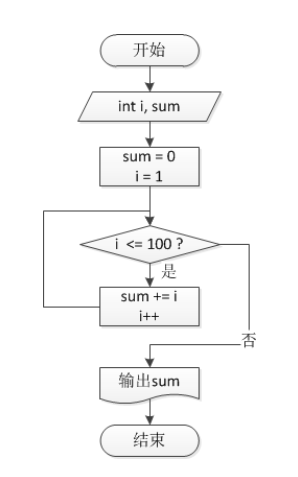


**编程语言（Programming Language）**

编程语言主要分为面向机器、面向过程和面向对象三类。C语言是面向过程的语言，常用于操作系统、嵌入式系统、驱动程序、图形引擎、图像处理、声音效果等。

C语言是一个结构化的编程语言，因此它层次清晰便于按模块化方式组织程序，易于调试和维护。然而结构化的缺点也很明显，比如程序的可重用性差。


<div style="page-break-after: always;"></div>

## 1.2 Hello World!

**Hello World!**

---

【代码】Hello World!

```c
#include <stdio.h>

int main()
{
    printf("Hello World!\n");
    return 0;
}
```

>  运行结果

```
Hello World!
```

---

第一行语句为预处理指令，预处理指令以`#`开头，`#include`表示程序需要使用头文件`stdio.h`中的函数，`stdio.h`文件中包含了有关输入输出语句的函数。

`main()`是C程序的入口，在程序的主体部分，`printf()`的功能是在屏幕上输出"Hello World"这个字符串，`\n`表示换行符。

C语言中`;`表示语句结束，注意不要使用中文的分号。一条语句可以跨越多行，并且用分号通知编译器该语句结束。


**编译器（Compiler）**

编译器的作用是将程序编译成计算机能够识别的二进制文件。

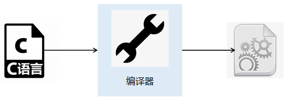

<div style="page-break-after: always;"></div>

## 1.3 Error or Warning?

**Error / Warning**

在编写程序的过程中，错误是不可避免的，错误主要能够分为以下三种类别：

1. 语法错误（syntax error）：程序的语法不合符编程语言的要求，编译器会反馈报错信息。
2. 逻辑错误（logical error）：人类在编程过程中的逻辑错误，无法被编译器所检测。
3. 运行时错误（runtime error）例如除以0、数组越界、指针越界、使用已经释放的空间、栈溢出等情况，可以被编译器发现。


<div style="page-break-after: always;"></div>

## 1.4 注释

**注释（Comment）**

在编程中加入注释可以增加程序的可读性和可维护性，编译器不会对注释的部分进行编译。

C语言中注释分为两类：

1. 单行注释：将一行内`//`之后的内容视为注释
2. 多行注释：以`\*`开始，`*/`结束，中间的内容视为注释

---

【代码】注释

```c
/*
    这个程序在屏幕上是输出Hello World
*/
#include <stdio.h>              // 头文件

int main()
{
    printf("Hello World!\n");   // 输出
    return 0;
}
```

>  运行结果

```
Hello World!
```

---

<div style="page-break-after: always;"></div>

## 1.5 不同语言的Hello World

**编程语言对比**

---

【代码】C++

```c++
#include <iostream>
using namespace std;

int main() {
    cout << "Hello World" << endl;
    return 0;
}
```

---

【代码】Java

```java
public class HelloWorld {
    public static void main(String[] args) {
        System.out.println("Hello World");
    }
}
```

---

【代码】Python

```python
print("Hello World")
```

---

<div style="page-break-after: always;"></div>

# 第2章 数据类型

## 2.1 变量

**变量（Variable）**

C语言是一种强类型的语言，任何数据都有一个确定的类型。

变量是计算机中一块特定的内存空间，由一个或多个连续的字节组成，不同数据存入具有不同内存地址的空间，相互独立，通过变量名可以简单快速地找到在内存中存储的数据。

变量名需要符合以下的要求：

1. 由字母、数字和下划线组成，第一个字符必须为字母或下划线
2. 不能包含除`_`以外的任何特殊字符，如`%`、`#`等
3. 不可以使用保留字或关键字
4. 准确、顾名思义，不要使用汉语拼音

关键字是编程语言内置的一些名称，具有特殊的用处和意义。

|  关键字  |         |        |          |        |
| :------: | :-----: | :----: | :------: | :----: |
|   auto   |  break  |  case  |   char   | const  |
| continue | default |   do   |  double  |  else  |
|   enum   | extern  | float  |   for    |  goto  |
|    if    |   int   |  long  | register | return |
|  short   | signed  | sizeof |  static  | struct |
|  switch  | typedef | union  | unsigned |  void  |
| volatile |  while  | inline | restrict |        |


**数据类型**

C语言中变量主要有三大类型：

1. 整型
    - 短整型`short`
    - 整型`int`
    - 长整型`long`
    - 长长整型`long long`
2. 浮点型
    - 单精度浮点型`float`
    - 双精度浮点型`double`
3. 字符型`char`

| 数据类型 | 位数 | 取值范围                    | 取值范围                 |
| :------: | :--: | --------------------------- | :----------------------- |
|   int    |  32  | $ -2^{31} \sim 2^{31} - 1 $ | -2147483648 ~ 2147483647 |
|  short   |  16  | $ -2^{15} \sim 2^{15} - 1 $ | -32768 ~ 32767           |
|   long   |  32  | $ -2^{31} \sim 2^{31} - 1 $ |                          |
|  float   |  32  | $ -3.4E38 \sim 3.4E38 $     |                          |
|  double  |  64  | $ -1.7E308 \sim 1.7E308 $   |                          |
|   char   |  8   | $ -2^7 \sim 2^7 - 1 $       | -128 ~ 127               |

<div style="page-break-after: always;"></div>

## 2.2 初始化

**初始化（Initialization）**

变量可以在定义时初始化，也可以在定义后初始化。

在编程中，`=`不是数学中的`等于`符号，而是表示`赋值`，即将`=`右边的值赋给左边的变量。

```c
int n = 10;
double wage = 8232.56;
```


**常量（Constant）**

常量是一个固定值，在程序执行期间不会改变，即在定义后不可修改。常量可以是任何的基本数据类型，比如整数常量、浮点常量、字符常量。

---

【代码】常量

```c
#include <stdio.h>

int main()
{
    const double PI = 3.1415;
    PI = 4;
    return 0;
}
```

>  运行结果

```
error: assignment of read-only variable 'PI'
```

---

<div style="page-break-after: always;"></div>

## 2.3 算术运算符

**四则运算**

|  数学符号  |  C符号   | 含义 |
| :--------: | :------: | :--: |
|   $ + $    |  $ + $   | 加法 |
|   $ - $    |  $ - $   | 减法 |
| $ \times $ | $ \ast $ | 乘法 |
|  $ \div $  |  $ / $   | 除法 |
|            |  $ \% $  | 取模 |

C语言中除法`/`的意义与数学中不同：

1. 当相除的两个运算数都为整型，则运算结果为两个数进行除法运算后的整数部分，例如`21 / 5`的结果为`4`。
2. 如果两个运算数其中至少一个为浮点型，则运算结果为浮点型，如`21 / 5.0`的结果为`4.2`。

取模（modulo）`%`表示求两个数相除之后的余数，如`22 % 3`的结果为`1`、`4 % 7`的结果为`4`。


**复合赋值运算符**

| 运算符 | 描述                  |
| :----: | :-------------------- |
|   +=   | a += b等价于a = a + b |
|   -=   | a -= b等价于a = a - b |
|   *=   | a *= b等价于a = a * b |
|   /=   | a /= b等价于a = a / b |
|   %=   | a %= b等价于a = a % b |

<div style="page-break-after: always;"></div>

## 2.4 输入输出函数

**printf()**

`printf()`的功能是向屏幕输出指定格式的字符串内容。在对变量的值进行输出时，需要使用相应数据类型的占位符表示。

| 数据类型 | 占位符 |
| :------: | :----: |
|   int    |   %d   |
|   long   |  %ld   |
|  float   |   %f   |
|  double  |   %f   |
|   char   |   %c   |


**转义字符**

在一个字符串描述的过程中，有可能会有一些特殊字符的信息。

| 转义字符 | 描述                       |
| :------: | :------------------------- |
|    \     | 续行符，实现字符串多行定义 |
|   \\\    | 表示一个反斜杠`\`          |
|   \\'    | 表示一个单引号`'`          |
|   \\"    | 表示一个双引号`"`          |
|    \n    | 换行                       |
|    \t    | 横向制表符                 |
|    \v    | 纵向制表符                 |
|    \f    | 换页                       |
|    \b    | 退格                       |

---

【代码】转义字符

```c
#include <stdio.h>

int main()
{
    printf("全球最大同性交友网站\n");
    printf("\'https://github.com\'");
    return 0;
}
```

> 运行结果

```
全球最大同性交友网站
'https://github.com'
```

---


**scanf()**

`scanf()`的作用是读取用户从键盘上的输入。在将值赋给对应的变量时，需要使用取地址符`&`，即将输入的值存放到该变量的内存地址中。

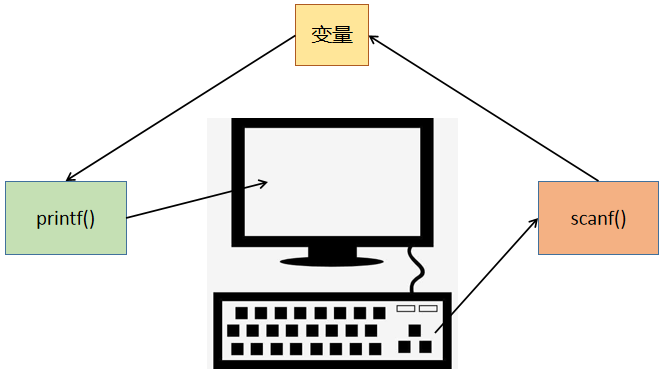

---

【代码】计算长方形面积

```c
#include <stdio.h>

int main()
{
    double length, width;
    double area;

    printf("输入长度：");
    scanf("%lf", &length);
    printf("输入宽度：");
    scanf("%lf", &width);

    area = length * width;
    printf("面积 = %.2f\n", area);
    return 0;
}
```

> 运行结果

```
输入长度：20
输入宽度：30
面积 = 600.00
```

---

【代码】计算圆面积

```c
#include <stdio.h>

int main()
{
    double r;   //半径
    double area;
    const double PI = 3.14159;

    printf("输入半径：");
    scanf("%lf", &r);

    area = PI * r * r;
    printf("面积 = %f\n", area);
    return 0;
}
```

> 运行结果

```
输入半径：5
面积 = 78.539750
```

---

【代码】逆序三位数

```c
#include <stdio.h>

int main()
{
    int num;
    int a, b, c;

    printf("输入一个正三位数：");
    scanf("%d", &num);

    a = num / 100;
    c = num % 10;
    b = num / 10 % 10;

    printf("逆序：%d\n", c*100 + b*10 + a);
    return 0;
}
```

> 运行结果

```
输入一个正三位数：520
逆序：25
```

---

<div style="page-break-after: always;"></div>

## 2.5 类型转换

**类型转换**

类型转换是把变量从一种类型转换为另一种数据类型。类型转换可以是隐式的，由编译器自动执行，也可以是显式的，通过使用强制类型转换运算符来指定。在有需要类型转换时都用上强制类型转换运算符是一种良好的编程习惯。

---

【代码】隐式类型转换

```c
#include <stdio.h>

int main()
{
    double a = 2.717;
    int b = a;
    printf("b = %d\n", b);
    return 0;
}
```

> 运行结果

```
b = 2
```

---

【代码】显式类型转换

```c
#include <stdio.h>

int main()
{
    int sum = 821;
    int num = 10;
    double average = (double)sum / num;
    printf("average = %.2f\n", average);
    return 0;
}
```

> 运行结果

```
82.10
```

---

<div style="page-break-after: always;"></div>

# 第3章 判断

## 3.1 逻辑运算符

**关系运算符**

| 数学符号 | 关系运算符 |
| :------: | :--------: |
|  $ < $   |   $ < $    |
|  $ > $   |   $ > $    |
| $ \leq $ |   $ <= $   |
| $ \geq $ |   $ >= $   |
| $ \neq $ |   $ != $   |
|  $ = $   |   $ == $   |


**逻辑运算符**

C语言中逻辑运算符有三种：

1. 逻辑与`&&`（logical AND）：当多个条件同时为真，结果为真。

| 条件1 | 条件2 | 条件1 && 条件2 |
| :---: | :---: | :------------: |
|   T   |   T   |       T        |
|   T   |   F   |       F        |
|   F   |   T   |       F        |
|   F   |   F   |       F        |

2. 逻辑或`||`（logical OR）：多个条件有一个为真时，结果为真。

| 条件1 | 条件2 | 条件1 \|\| 条件2 |
| :---: | :---: | :------------: |
| T     | T     | T              |
| T     | F     | T              |
| F     | T     | T              |
| F     | F     | F              |

3. 逻辑非`!`（logical NOT）：条件为真时，结果为假；条件为假时，结果为真。

| 条件 | !条件 |
| :--: | :---: |
|  T   |   F   |
|  F   |   T   |

<div style="page-break-after: always;"></div>

## 3.2 if

**if**

当`if`语句的条件为真时，进入花括号执行内部的代码；若条件为假，则跳过花括号执行后面的代码。

`if`语句主要有以下几种形式：

- 单分支

```c
if(条件)
{
    // code
}
```

- 双分支

```c
if(条件)
{
    // code
}
else
{
    // code
}
```

- 多分支

```c
if(条件1)
{
    // code
}
else if(条件2)
{
    // code
}
else
{
    // code
}
```


---

【代码】if

```c
#include <stdio.h>

int main()
{
    int age = 15;
    if(age > 0 && age < 18)
    {
        printf("未成年\n");
    }
    return 0;
}
```

> 运行结果

```
未成年
```

---

【代码】if-else

```c
#include <stdio.h>

int main()
{
    int age = 30;
    if(age > 0 && age < 18)
    {
        printf("未成年人\n");
    }
    else
    {
        printf("成年人\n");
    }
    return 0;
}
```

> 运行结果

```
成年人
```

---

【代码】if-else_if-else

```c
#include <stdio.h>

int main()
{
    int score = 76;

    if(score >= 90 && score <= 100)
    {
        printf("优秀\n");
    }
    else if(score >= 60)
    {
        printf("合格\n");
    }
    else
    {
        printf("不合格\n");
    }

    return 0;
}
```

> 运行结果

```
合格
```

---


**嵌套结构**

`if`语句也可以嵌套使用：

```c
if(条件1)
{
    if(条件2)
    {
        // code
    }
}
```

---

【代码】判断整数奇偶

```c
#include <stdio.h>

int main()
{
    int num;

    printf("输入一个正整数：");
    scanf("%d", &num);

    if(num > 0)
    {
        if(num % 2 == 0)
        {
            printf("%d是偶数\n", num);
        }
        else
        {
            printf("%d是奇数\n", num);
        }
    }
    return 0;
}
```

> 运行结果

```
输入一个正整数：66
66是偶数
```

---

<div style="page-break-after: always;"></div>

## 3.3 switch

**switch**

`switch-case`结构可以对整数值的表达式进行判断。

```c
switch(表达式)
{
    case label:
        //code
        break;
    // ...
    default:
        //code
        break;
}
```

根据表达式的值，跳转到对应的`case`处进行执行。需要注意的是，当对应的`case`中的代码被执行完后，并不会跳出`switch`，而是会继续执行后面的代码，所以需要使用`break`跳出`switch`结构。

当所有`case`都不满足表达式的值时，会执行`default`语句中的代码，相当于`if-else`结构中的`else`。

---

【代码】根据月份输出对应的英语简写

```c
#include <stdio.h>

int main()
{
    int month;
    printf("输入月份：");
    scanf("%d", &month);

    switch(month)
    {
        case 1:
            printf("Jan.\n");
            break;
        case 2:
            printf("Feb.\n");
            break;
        case 3:
            printf("Mar.\n");
            break;
        case 4:
            printf("Apr.\n");
            break;
        case 5:
            printf("May\n");
            break;
        case 6:
            printf("Jun.\n");
            break;
        case 7:
            printf("Jul.\n");
            break;
        case 8:
            printf("Aug.\n");
            break;
        case 9:
            printf("Sep.\n");
            break;
        case 10:
            printf("Oct.\n");
            break;
        case 11:
            printf("Nov.\n");
            break;
        case 12:
            printf("Dec.\n");
            break;
        default:
            printf("输入有误\n");
            break;
    }
    return 0;
}
```

> 运行结果

```
输入月份：5
May
```

---

<div style="page-break-after: always;"></div>

# 第4章 循环

## 4.1 自增/自减运算符

**自增/自减运算符**

单目运算符中自增`++`和自减`--`运算符可以将变量的值加1和减1，但是`++`和`--`可以出现在变量之前或之后，即有四种情况：

1. 前缀自增
2. 前缀自减
3. 后缀自增
4. 后缀自减

| 表达式  | 含义                 |
| :-----: | -------------------- |
| count++ | 执行完所在语句后自增 |
| ++count | 执行所在语句前自增   |
| count-- | 执行完所在语句后自减 |
| --count | 执行所在语句前自减   |

<div style="page-break-after: always;"></div>

## 4.2 while

**while**

在`while`循环中，当条件满足时重复循环体内的语句。如果条件永远为真，循环会永无止境的进行下去（死循环），因此循环体内要有改变条件的机会。

控制循环次数的方法就是设置循环变量：初值、判断、更新。

`while`循环的特点是先判断、再执行，所以循环体有可能会进入一次或多次，也有可能一次也不会进入。

```c
while(条件)
{
    // code
}
```

---

【代码】计算5个人的平均身高

```c
#include <stdio.h>

int main()
{
    double height;
    double total = 0;
    double average;
    int i = 1;

    while(i <= 5)
    {
        printf("输入第%d个人的身高：", i);
        scanf("%lf", &height);
        total += height;
        i++;
    }

    average = total / 5;
    printf("平均身高：%.2f\n", average);
    return 0;
}
```

> 运行结果

```
输入第1个人的身高：160.8
输入第2个人的身高：175.2
输入第3个人的身高：171.2
输入第4个人的身高：181.3
输入第5个人的身高：164
平均身高：170.5
```

---

<div style="page-break-after: always;"></div>

## 4.3 do-while

**do-while**

`do-while`循环在进入循环的时候不做检查，而是在执行完一轮循环体的代码之后，再来检查循环的条件是否满足，如果满足则继续下一轮循环，不满足则结束循环，即至少执行一次循环。

`do-while`循环的主要特点是先执行、再判断。

```c
do
{
    // code
} while(条件);
```

---

【代码】计算整数位数

```c
#include <stdio.h>

int main()
{
    int num;
    int n = 0;

    printf("输入整数：");
    scanf("%d", &num);

    do
    {
        num /= 10;
        n++;
    } while(num != 0);

    printf("位数：%d\n", n);
    return 0;
}
```

> 运行结果

```
输入整数：123
位数：3
```

---


**while与do-while区别**

`while`循环与`do-while`循环有以下区别：

1. 执行顺序不同。
2. 初始情况不满足循环条件时，`while`循环一次都不会执行，`do-while`循环不管任何情况都至少执行一次。
3. `do-while`循环的`while`语句后有`;`。


---

【代码】计算元音、辅音个数

```c
#include <stdio.h>

int main()
{
    char c;
    int vowel = 0;
    int consonant = 0;

    printf("输入一句英语句子：");

    while((c = getchar()) != '\n')
    {
        if(c == 'a' || c == 'e' 
           || c == 'i' || c == 'o' 
           || c == 'u' || c == 'A' 
           || c == 'E' || c == 'I' 
           || c == 'O' || c == 'U')
        {
            vowel++;
        }
        else if((c >= 'a' && c <= 'z') 
                || (c >= 'A' && c <= 'Z'))
        {
            consonant++;
        }
    }

    printf("元音 = %d\n", vowel);
    printf("辅音 = %d\n", consonant);
    return 0;
}
```

> 运行结果

```
输入一句英语句子：Hello World
元音 = 3
辅音 = 7
```

---

【代码】猜数字

```c
#include <stdio.h>
#include <stdlib.h>     //标准库
#include <time.h>

int main()
{
    srand(time(NULL));         //时间种子
    int answer = rand() % 100 + 1;  //产生1-100之间的随机数
    int num = 0;
    int cnt = 0;

    do
    {
        printf("猜一个1-100之间的数字：");
        scanf("%d", &num);
        cnt++;

        if(num > answer)
        {
            printf("猜大了！\n");
        }
        else if(num < answer)
        {
            printf("猜小了！\n");
        }
    } while(num != answer);

    printf("猜对了！你一共用了%d次猜对！\n", cnt);
    return 0;
}
```

> 运行结果

```
猜一个1-100之间的数字：50
猜大了！
猜一个1-100之间的数字：25
猜小了！
猜一个1-100之间的数字：37
猜小了！
猜一个1-100之间的数字：43
猜小了！
猜一个1-100之间的数字：46
猜小了！
猜一个1-100之间的数字：48
猜小了！
猜一个1-100之间的数字：49
猜对了！你一共用了7次猜对！
```

---

<div style="page-break-after: always;"></div>

## 4.4 for

**for**

`for`循环有三个表达式，中间用`;`分隔，`;`不可省略。

```c
for(表达式1; 表达式2; 表达式3)
{
    //code
}
```

- 表达式1通常是为循环变量赋初值，可省略
- 表达式2是循环条件，判断是否继续执行循环，可省略
- 表达式3为更新循环变量的值，可省略

---

【代码】计算1-100的累加和

```c
#include <stdio.h>

int main()
{
    int sum = 0;
    for(int i = 1; i <= 100; i++)
    {
        sum += i;
    }
    printf("累加：%d\n", sum);
    return 0;
}
```

> 运行结果

```
累加：5050
```

---

【代码】计算$ 1 + {1 \over 2} + {1 \over 3} + ... + {1 \over n} $

```c
#include <stdio.h>

int main()
{
    int n;
    double sum = 0.0;

    printf("输入n：");
    scanf("%d", &n);

    for(int i = 1; i <= n; i++)
    {
        sum += 1.0 / i;
    }

    printf("%f\n", sum);
    return 0;
}
```

> 运行结果

```
输入n：10
2.928968
```

---

【代码】斐波那契数列（兔子数列）


```c
#include <stdio.h>

int main()
{
    int n;
    int num1, num2, val;

    printf("输入斐波那契数列长度：");
    scanf("%d", &n);

    if(n == 1)
    {
        printf("1\n");
    }
    else if(n == 2)
    {
        printf("1, 1\n");
    }
    else
    {
        num1 = 1;
        num2 = 1;
        printf("1, 1");
        for(int i = 3; i <= n; i++)
        {
            val = num1 + num2;
            printf(", %d", val);
            num1 = num2;
            num2 = val;
        }
        printf("\n");
    }
    return 0;
}
```

> 运行结果

```
输入斐波那契数列长度：10
1, 1, 2, 3, 5, 8, 13, 21, 34, 55
```

---


**嵌套循环**

循环也可以进行嵌套使用。

---

【代码】九九乘法表


```c
#include <stdio.h>

int main()
{
    for(int i = 1; i <= 9; i++)
    {
        for(int j = 1; j <= 9; j++)
        {
            printf("%d*%d=%d\t", i, j, i*j);
        }
        printf("\n");
    }
    return 0;
}
```

---

【代码】输出图案

```
*
**
***
****
*****
```

```c
#include <stdio.h>

int main()
{
    for(int i = 1; i <= 5; i++)
    {
        for(int j = 1; j <= i; j++)
        {
            printf("*");
        }
        printf("\n");
    }
    return 0;
}
```

---

<div style="page-break-after: always;"></div>

## 4.5 break or continue?

**循环控制**

循环控制语句的作用是控制当前的循环结构是否继续向下执行，如果不进行控制，那么会根据既定的结构重复执行。如果有一些特殊的情况导致循环的执行中断，就称为循环的控制语句。循环控制语句的关键字有`break`和`continue`。

`break`的作用是跳出当前循环，执行当前循环之后的语句。`break`只能跳出一层循环，如果是嵌套循环，那么需要按照嵌套的层次，逐步使用`break`来跳出。`break`语句只能在循环体内和`switch`语句内使用。

`continue`的作用是跳过本轮循环，开始下一轮循环的条件判断。`continue`终止当前轮的循环过程，但它并不跳出循环。

---

【代码】break

```c
#include <stdio.h>

int main()
{
    for(int i = 1; i <= 10; i++)
    {
        if(i == 5)
        {
            break;
        }
        printf("%d ", i);
    }
    return 0;
}
```

> 运行结果

```
1 2 3 4 
```

---

【代码】continue

```c
#include <stdio.h>

int main()
{
    for(int i = 1; i <= 10; i++)
    {
        if(i == 5)
        {
            continue;
        }
        printf("%d ", i);
    }
    return 0;
}
```

> 运行结果

```
1 2 3 4 6 7 8 9 10
```

---

<div style="page-break-after: always;"></div>

# 第5章 数组

## 5.1 一维数组

**数组（Array）**

数组可以用于声明多个具有相同类型的变量，它们共享同一个名字，数组中的每个变量都能被其下标所访问。数组一旦创建就不能改变大小。

```c
int number[10];
float grade[50];
```

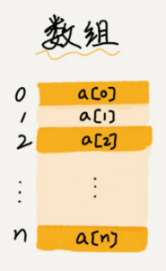

- 元素：数组中的每个变量

- 大小：数组的容量

- 下标 / 索引（index）：元素的位置，下标从0开始，必须为非负整数


**数组初始化**

一维数组可以在声明时进行初始化：

```c
int arr[10] = {3, 6, 8, 2, 4, 0, 9, 7, 1, 5};
```

很多时候在使用数组之前需要将数组的内容全部清空，这可以利用循环来实现。

```c
int arr[100];
for(int i = 0; i < 100; i++)
{
    arr[0] = 0;
}
```

---

【代码】数组最大值和最小值

```c
#include <stdio.h>

int main()
{
    int num[] = {7, 6, 2, 9, 3, 1, 4, 0, 5, 8};
    int n = sizeof(num) / sizeof(int);
    int max = num[0];
    int min = num[0];

    for(int i = 1; i < n; i++)
    {
        if(num[i] > max)
        {
            max = num[i];
        }
        else if(num[i] < min)
        {
            min = num[i];
        }
    }

    printf("max = %d\n", max);
    printf("min = %d\n", min);
    return 0;
}
```

> 运行结果

```
max = 9
min = 0
```

---

<div style="page-break-after: always;"></div>

## 5.2 二维数组

**二维数组（2D Array）**

二维数组包括行和列两个维度，可以看成是由多个一维数组组成。

|  二维数组   |             |             |             |
| :---------: | :---------: | :---------: | :---------: |
| a\[0\]\[0\] | a\[0\]\[1\] | a\[0\]\[2\] | a\[0\]\[3\] |
| a\[1\]\[0\] | a\[1\]\[1\] | a\[1\]\[2\] | a\[1\]\[3\] |
| a\[2\]\[0\] | a\[2\]\[1\] | a\[2\]\[2\] | a\[2\]\[3\] |

二维数组可以在声明时进行初始化：

```c
int arr[2][2] = {{1, 2}, {3, 4}};
```

---

【代码】初始化二维数组

```c
#include <stdio.h>

int main()
{
    int arr[3][4];
    for(int i = 0; i < 3; i++)
    {
        for(int j = 0; j < 4; j++)
        {
            arr[i][j] = 0;
        }
    }
    return 0;
}
```

---

【代码】矩阵运算

> 矩阵的加法/减法是指两个矩阵把其相对应元素进行加减的运算。
>
> 矩阵加法：两个$ m \times n $矩阵A和B的和，标记为$ A + B $，结果为一个$ m \times n $的矩阵，其内的各元素为其相对应元素相加后的值。
>
> 矩阵减法：两个$ m \times n $矩阵A和B的差，标记为$ A - B $，结果为一个$ m \times n $的矩阵，其内的各元素为其相对应元素相减后的值。
> 
> $$
> \left[\begin{matrix} 
> 	1 & 3 \\
> 	1 & 0 \\
> 	1 & 2 \\
> \end{matrix} \right]
> +
> \left[\begin{matrix} 
> 	0 & 0 \\
> 	7 & 5 \\
> 	2 & 1 \\
> \end{matrix} \right]
> =
> \left[\begin{matrix} 
> 	1+0 & 3+0 \\
> 	1+7 & 0+5 \\
> 	1+2 & 2+1 \\
> \end{matrix} \right]
> =
> \left[\begin{matrix} 
> 	1 & 3 \\
> 	8 & 5 \\
> 	3 & 3 \\
> \end{matrix} \right]
> $$
>
> $$
> \left[\begin{matrix} 
> 	1 & 3 \\
> 	1 & 0 \\
> 	1 & 2 \\
> \end{matrix} \right]
> -
> \left[\begin{matrix} 
> 	0 & 0 \\
> 	7 & 5 \\
> 	2 & 1 \\
> \end{matrix} \right]
> =
> \left[\begin{matrix} 
> 	1-0 & 3-0 \\
> 	1-7 & 0-5 \\
> 	1-2 & 2-1 \\
> \end{matrix} \right]
> =
> \left[\begin{matrix} 
> 	1 & 3 \\
> 	-6 & -5 \\
> 	-1 & 1 \\
> \end{matrix} \right]
> $$

```c
#include <stdio.h>

int main() {
    int A[3][2] = {
        {1, 3},
        {1, 0},
        {1, 2}
    };
    int B[3][2] = {
        {0, 0},
        {7, 5},
        {2, 1}
    };
    int C[3][2];

    printf("矩阵加法\n");
    for(int i = 0; i < 3; i++) {
        for(int j = 0; j < 2; j++) {
            C[i][j] = A[i][j] + B[i][j];
            printf("%3d", C[i][j]);
        }
        printf("\n");
    }

    printf("矩阵减法\n");
    for(int i = 0; i < 3; i++) {
        for(int j = 0; j < 2; j++) {
            C[i][j] = A[i][j] - B[i][j];
            printf("%3d", C[i][j]);
        }
        printf("\n");
    }
    
    return 0;
}
```

> 运行结果

```
矩阵加法
1  3
8  5
3  3
矩阵减法
1  3
-6 -5
-1  1
```

---

<div style="page-break-after: always;"></div>

## 5.3 字符串

**字符串（String）**

由字符组成的数组成为字符串。字符串有两种初始化的方式。第一种就是普通的数组初始化形式，另一种是直接使用双引号。

```c
char str[8] = {'p', 'r', 'o', 'g', 'r', 'a', 'm', '\0'};
char str[8] = "program";
```

字符串结尾需要添加一个字符`\0`表示结束符，字符串遇到`\0`结束。`\0`占一个字符的大小，记入字符数组的大小。

通过`%s`占位符可以对字符串进行输入输出操作：

```c
printf("%s", str);
puts(str);

scanf("%s", str);
gets(str);
```

使用`scanf()`读取字符串的时候，字符串会读到空格为止，空格后的内容不会被保存到字符串中。如果需要能够读取字符串直到回车键为止，可以使用`gets()`。

---

【代码】字符串输入输出

```c
#include <stdio.h>

int main() {
    char str[32];
    printf("输入字符串：");
    gets(str);
    printf("%s\n", str);
    return 0;
}
```

> 运行结果

```
输入字符串：hello world
hello world
```

---

【代码】统计字符串中某个字符出现的次数

```c
#include <stdio.h>

int main() {
    char str[32];       // 字符串
    char c;             // 待统计字符
    int cnt = 0;        // 出现次数
    int i = 0;

    printf("输入字符串：");
    gets(str);
    printf("输入待统计字符：");
    c = getchar();

    while(str[i] != '\0') {
        if(str[i] == c) {
            cnt++;
        }
        i++;
    }

    printf("%c在%s中出现了%d次\n", c, str, cnt);
    return 0;
}
```

> 运行结果

```
输入字符串：this is a test
输入待统计字符：t
t在this is a test中出现了3次
```

---


**ASCII码**

`ASCII`全称`American Standard Code for Information Interchange`（美国信息交换标准代码），一共定义了128个字符。

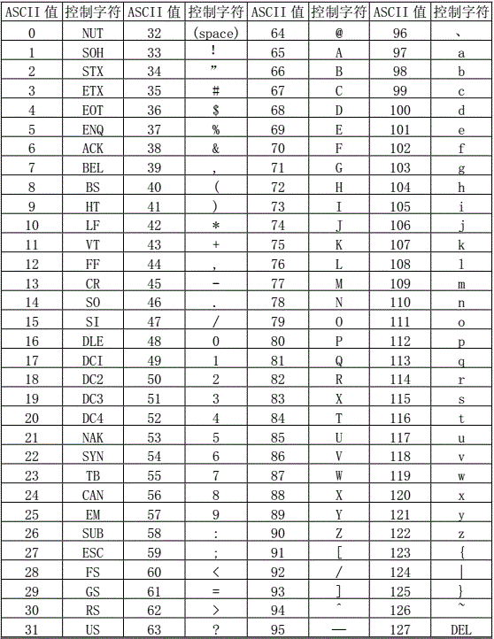

---

【代码】ASCII码

```c
#include <stdio.h>

int main() {
    for(int i = 0; i < 128; i++) {
        printf("%d - %c\n", i, i);
    }
    return 0;
}
```

---


**字符串操作函数**

C语言的系统库中提供了一些对字符串的常用操作函数，这些函数都定义在`string.h`头文件中。

1. `strlen()`：计算字符串的长度（不包括`\0`结束符）。

---

【代码】strlen()计算字符串长度

```c
#include <stdio.h>
#include <string.h>

int main() {
    char s[32] = "hello world";
    printf("字符串长度 = %d\n", strlen(s));
    return 0;
}
```

> 运行结果

```
字符串长度 = 11
```

---

2. `strcpy()`：将一个字符串复制到另一个字符串中，须确保第一个字符串有足够大的长度。

---

【代码】strcpy()字符串复制

```c
#include <stdio.h>
#include <string.h>

int main() {
    char s1[32] = "hello world";
    char s2[32] = "program";

    strcpy(s1, s2);
    printf("s1 = %s\n", s1);
    printf("s2 = %s\n", s2);
    return 0;
}
```

> 运行结果

```
s1 = program
s2 = program
```

---

3. `strcat()`：将第二个字符串拼接到第一个字符串尾部，须确保第一个字符串有足够大的长度。

---

【代码】strcat()字符串拼接

```c
#include <stdio.h>
#include <string.h>

int main() {
    char s1[32] = "hello";
    char s2[32] = "world";

    strcat(s1, s2);     // 把s2拼接到s1后面，s2不发生改变
    printf("s1 = %s\n", s1);
    printf("s2 = %s\n", s2);
    return 0;
}
```

> 运行结果

```
s1 = helloworld
s2 = world
```

---

4. `strcmp()`：比较两个字符串的大小，依次比较字符串中每一个字符的`ASCII`码。
    - 返回负数：字符串1小于字符串2
    - 返回正数：字符串1大于字符串2
    - 返回0：字符串1等于字符串2

---

【代码】strcmp()字符串比较

```c
#include <stdio.h>
#include <string.h>

int main() {
    char s1[32] = "communication";
    char s2[32] = "compare";
    printf("strcmp()比较结果：%d\n", strcmp(s1, s2));
    return 0;
}
```

> 运行结果

```
strcmp()比较结果：-1
```

---

【代码】实现一个简单的登录功能

```c
/**
 * 缓冲区溢出
 * 用户名输入：[32个任意字符] + [新用户名]
 * 密  码输入：[32个任意字符] + [新密  码]
 * 产生缓冲区溢出，密码被篡改
 * 下一次登录输入新用户名和密码就能实现成功登录
 */
#include <stdio.h>
#include <string.h>

int main() {
    char username[16] = "admin";
    char password[16] = "qwerty";
    char input_username[16];
    char input_password[16];

    while(1) {
        printf("用户名：");
        gets(input_username);
        printf("密  码：");
        gets(input_password);

        if(strcmp(input_username, username) == 0
            && strcmp(input_password, password) == 0) {
            printf("登录成功！\n");
            break;
        } else {
            printf("用户名或密码错误！\n");
        }
    }

    return 0;
}
```

> 运行结果

```
用户名：admin
密  码：qwerty
登录成功！
```

---

<div style="page-break-after: always;"></div>

## 5.4 字符串数组

**字符串数组**

字符串数组就是由多个字符串组成的数组，可以看作是一个二维的字符数组，其中第一维表示字符串数组的大小，第二维表示每个字符串的最大长度。

```c
char str[4][12] = {"C++", "Java", "Python", "JavaScript"};
```

| str  |      |      |      |      |      |      |      |      |      |      |      |
| :--: | :--: | :--: | :--: | :--: | :--: | :--: | :--: | :--: | :--: | :--: | :--: |
|  C   |  +   |  +   |  \0  |      |      |      |      |      |      |      |      |
|  J   |  a   |  v   |  a   |  \0  |      |      |      |      |      |      |      |
|  P   |  y   |  t   |  h   |  o   |  n   |  \0  |      |      |      |      |      |
|  J   |  a   |  v   |  a   |  S   |  c   |  r   |  i   |  p   |  t   |  \0  |      |

> - str[0]："C++"
> - str[1]："Java"
> - str\[0\][0]：'C'
> - str\[0\][1]：'+'
> - str\[0\][2]：'+'

---

【代码】遍历字符串数组

```c
#include <stdio.h>

int main() {
    char str[4][12] = {"C++", "Java", "Python", "JavaScript"};
    for(int i = 0; i < 4; i++) {
        printf("%s\n", str[i]);
    }
    return 0;
}
```

> 运行结果

```
C++
Java
Python
JavaScript
```

---

<div style="page-break-after: always;"></div>

# 第6章 函数

## 6.1 函数

**函数（Function）**

函数执行一个特定的任务，每个C程序都至少有一个函数`main()`。C标准库提供了大量内置函数，例如`strlen()`用来计算字符串的长度、`printf()`用来进行格式化输出等。

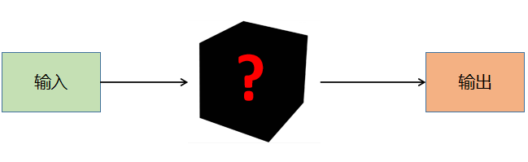

当调用函数时，程序控制权会转移给被调用的函数，当函数执行结束后，函数会把程序序控制权交还给其调用者。

```mermaid
graph TB
	subgraph Callee
		code2 --> code3
	end

	subgraph Caller
		code1 --> call
		call --> code5
	end
	
	call --> code2
	code3 --> call
```


**函数声明与定义**

函数声明时需要告诉编译器函数的名称、返回类型和参数。在函数声明时，参数的名称可以省略，但是参数的类型是必须的。

```c
data_type function_name(parameter_list);
```

函数的参数列表包括参数的类型、顺序、数量等信息，参数列表可以为空。

函数可以返回一个值，函数的返回类型为被返回的值的类型。函数也可以不返回任何值，此时函数的返回类型应定义为`void`。

```c
data_type function_name(parameter_list) {
    // code
}
```


**函数设计方法**

为什么不把所有的代码全部写在`main()`中，还需要自定义函数呢？

使用函数有以下好处：

1. 避免代码复制，代码复制是程序质量不良的表现
2. 便于代码维护
3. 避免重复造轮子，提高开发效率

在设计函数的时候需要考虑以下的几点要素：

1. 确定函数的功能
2. 确定函数的参数
    - 是否需要参数
    - 参数个数
    - 参数类型
3. 确定函数的返回值
    - 是否需要返回值
    - 返回值类型

---

【代码】函数实现返回最大值

```c
#include <stdio.h>

// 函数原型
int max(int num1, int num2);

int main() {
    printf("%d\n", max(4, 12));
    printf("%d\n", max(54, 33));
    printf("%d\n", max(0, -12));
    printf("%d\n", max(-999, -774));
    return 0;
}

// 函数实现
int max(int num1, int num2) {
    // if(num1 > num2) {
    //     return num1;
    // } else {
    //     return num2;
    // }
    return num1 > num2 ? num1 : num2;
}
```

> 运行结果

```
12
54
0
-774
```

---

【代码】函数实现累加和

```c
#include <stdio.h>

int sum(int start, int end) {
    int total = 0;
    for(int i = start; i <= end; i++) {
        total += i;
    }
    return total;
}

int main() {
    printf("1-100的累加和 = %d\n", sum(1, 100));
    printf("1024-2048的累加和 = %d\n", sum(1024, 2048));
    return 0;
}
```

> 运行结果

```
1-100的累加和 = 5050
1024-2048的累加和 = 1574400
```

---

【代码】函数实现输出i行j列由自定义字符组成的图案

```c
#include <stdio.h>

void printChars(int row, int col, char c) {
    for(int i = 0; i < row; i++) {
        for(int j = 0; j < col; j++) {
            printf("%c", c);
        }
        printf("\n");
    }
}

int main() {
    printChars(5, 10, '?');
    return 0;
}
```

> 运行结果

```
??????????
??????????
??????????
??????????
??????????
```

---

【代码】自定义函数实现strlen()

```c
#include <stdio.h>

/**
 * @brief  自定义计算字符串长度函数
 * @param  str[]: 待计算字符串
 * @retval 字符串长度
 */
int myStrlen(char str[]) {
    int i = 0;
    while(str[i] != '\0') {
        i++;
    }
    return i;
}

int main() {
    char str[32] = "hello world";
    printf("字符串长度 = %d\n", myStrlen(str));
    return 0;
}
```

> 运行结果

```
字符串长度 = 11
```

---

【代码】自定义函数实现strcpy()

```c
#include <stdio.h>

/**
 * @brief  自定义字符串复制函数
 * @param  dst[]: 目标字符串
 * @param  src[]: 源字符串
 */
void myStrcpy(char dst[], char src[]) {
    int i = 0;
    while(src[i] != '\0') {
        dst[i] = src[i];
        i++;
    }
    dst[i] = '\0';
}

int main() {
    char s1[32] = "hello world";
    char s2[32] = "program";
    myStrcpy(s1, s2);
    printf("s1 = %s\n", s1);
    printf("s2 = %s\n", s2);
    return 0;
}
```

> 运行结果

```
s1 = program
s2 = program
```

---

【代码】自定义函数实现strcat()

```c
#include <stdio.h>

/**
 * @brief  自定义字符串拼接函数
 * @param  dst[]: 目标字符串
 * @param  src[]: 源字符串
 */
void myStrcat(char dst[], char src[]) {
    int i = 0;
    int j = 0;

    // 找到目标字符串尾部
    while(dst[i] != '\0') {
        i++;
    }
    while(src[j] != '\0') {
        dst[i++] = src[j++];
    }
    dst[i] = '\0';
}

int main() {
    char s1[32] = "hello";
    char s2[32] = "world";

    myStrcat(s1, s2);
    printf("s1 = %s\n", s1);
    printf("s2 = %s\n", s2);
    return 0;
}
```

> 运行结果

```
s1 = helloworld
s2 = world
```

---

<div style="page-break-after: always;"></div>

## 6.2 局部变量与全局变量

**局部变量（Local Varaible）**

定义在块内的变量就是本地变量，在进入块之前，其中的变量不存在，离开块，变量则释放。在一个块内不能定义同名的变量，并且本地变量不会被默认初始化。

本地变量的生存周期从声明时开始到所在块结束消亡，其作用域为所在的块中。

在函数中，函数的每次调用就会产生一个独立的空间，在这个空间中的变量，是函数的这次运行所独有的，函数的参数也是本地变量。

---

【代码】局部变量

```c
#include <stdio.h>

int main() {
    int a = 1;
    printf("a = %d\n", a);
    {
        int a = 2;
        printf("a = %d\n", a);
    }
    printf("a = %d\n", a);
    return 0;
}
```

> 运行结果

```
a = 1
a = 2
a = 1
```

---


**全局变量（Global Varaible）**

全局变量可以在程序任何地方创建，可以被本程序所有对象或函数引用。但是全局变量会占用更多的内存（因为其生命周期长），使用全局变量程序运行时速度更快一些（因为内存不需要再分配）。

全局变量的优先级低于局部变量，当全局变量与局部变量重名的时候，起作用的是局部变量，全局变量会被暂时屏蔽掉。

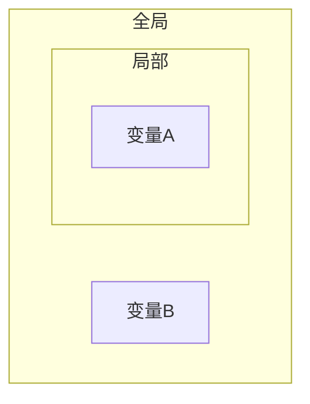

---

【代码】全局变量

```c
#include <stdio.h>

int a = 1;      // 全局变量

int main() {
    int a = 2;  // 本地变量
    printf("a = %d\n", a);
    return 0;
}
```

> 运行结果

```
a = 2
```

---

<div style="page-break-after: always;"></div>

## 6.3 递归

**递归（Recursion）**

要理解递归，先得理解递归（见6.3章节）。

在函数的内部，直接或者间接的调用自己的过程就叫作递归。对于一些问题，使用递归可以简洁易懂的解决问题，但是递归的缺点是性能低，占用大量系统栈空间。

递归算法很多时候可以处理一些特别复杂、难以直接解决的问题。

比如：

- 迷宫
- 汉诺塔
- 八皇后
- 排序
- 搜索

在定义递归函数时，一定要确定一个结束条件，否则会造成无限递归的情况，最终会导致栈溢出。

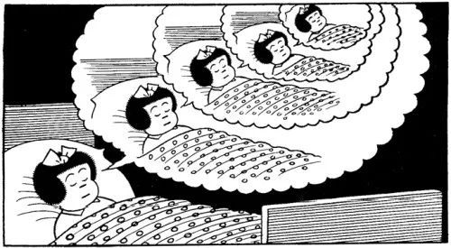


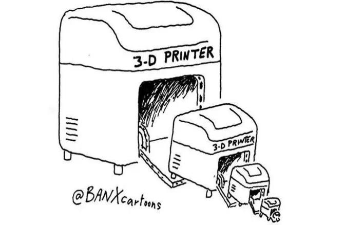


---

【代码】无限递归

```c
#include <stdio.h>

void tellStory() {
    printf("从前有座山\n");
    printf("山里有座庙\n");
    printf("庙里有个老和尚和小和尚\n");
    printf("老和尚在对小和尚讲故事\n");
    printf("他讲的故事是：\n");
    tellStory();
}

int main() {
    tellStory();
    return 0;
}
```

> 运行结果

```
从前有座山
山里有座庙
庙里有个老和尚和小和尚
老和尚对小和尚在讲故事
他讲的故事是：
从前有座山
山里有座庙
庙里有个老和尚和小和尚
老和尚对小和尚在讲故事
他讲的故事是：
...
```

---

递归函数一般需要定义递归的出口，即结束条件，确保递归能够在适合的地方退出。

---

【代码】阶乘

```c
#include <stdio.h>

int factorial(int n) {
    if(n == 0 || n == 1) {
        return 1;
    }
    return n * factorial(n-1);
}

int main() {
    printf("5! = %d\n", factorial(5));
    return 0;
}
```

> 运行结果

```
5! = 120
```


---

【代码】斐波那契数列（递归）

```c
#include <stdio.h>

int fibonacci(int n) {
    if(n == 1 || n == 2) {
        return 1;
    }
    return fibonacci(n-2) + fibonacci(n-1);
}

int main() {
    int n = 7;
    printf("斐波那契数列第%d位：%d\n", n, fibonacci(n));
    return 0;
}
```

> 运行结果

```
斐波那契数列第7位：13
```


---

【代码】斐波那契数列（迭代）

```c
#include <stdio.h>

int fibonacci(int n) {
    int f[n];
    f[0] = f[1] = 1;
    for(int i = 2; i < n; i++) {
        f[i] = f[i-2] + f[i-1];
    }
    return f[n-1];
}

int main() {
    int n = 7;
    printf("斐波那契数列第%d位：%d\n", n, fibonacci(n));
    return 0;
}
```

> 运行结果

```
斐波那契数列第7位：13
```

---

【代码】阿克曼函数
$$
A(m, n) =
\begin{cases}
	n + 1 & m = 0 \\
	A(m-1, 1) & m > 0, n = 0 \\
	A(m-1, A(m, n-1)) & m > 0, n > 0 \\
\end{cases}
$$

```c
#include <stdio.h>

int A(int m, int n) {
    if(m == 0) {
        return n + 1;
    } else if(m > 0 && n == 0) {
        return A(m-1, 1);
    } else if(m > 0 && n > 0) {
        return A(m-1, A(m, n-1));
    }
}

int main() {
    printf("%d\n", A(3, 4));
    return 0;
}
```

> 运行结果

```
125
```

|  m\n  |      0      |         1         |         2         |            3            |         4         |                           n                            |
| :---: | :---------: | :---------------: | :---------------: | :---------------------: | :---------------: | :----------------------------------------------------: |
| **0** |      1      |         2         |         3         |            4            |         5         |                       $ n + 1 $                        |
| **1** |      2      |         3         |         4         |            5            |         6         |                  $ 2 + (n + 3) - 3 $                   |
| **2** |      3      |         5         |         7         |            9            |        11         |                    $ 2(n + 3) - 3 $                    |
| **3** |      5      |        13         |        29         |           61            |        125        |                   $ 2^{n + 3} - 3 $                    |
| **4** |     13      |       65533       | $ 2^{65536} - 3 $ | $ A(3, 2^{65536} - 3) $ | $ A(3, A(4, 3)) $ | $ \underbrace{2^{2^{.^{.^{.{^2}}}}}}_{n+3\ twos} - 3 $ |
| **5** |    65533    |  $ A(4, 65533) $  | $ A(4, A(5, 1)) $ |    $ A(4, A(5, 2)) $    | $ A(4, A(5, 3)) $ |                       $ \dots $                        |
| **6** | $ A(5, 1) $ | $ A(5, A(5, 1)) $ | $ A(5, A(6, 1)) $ |    $ A(5, A(6, 2)) $    | $ A(5, A(6, 3)) $ |                       $ \dots $                        |


---

【代码】汉诺塔

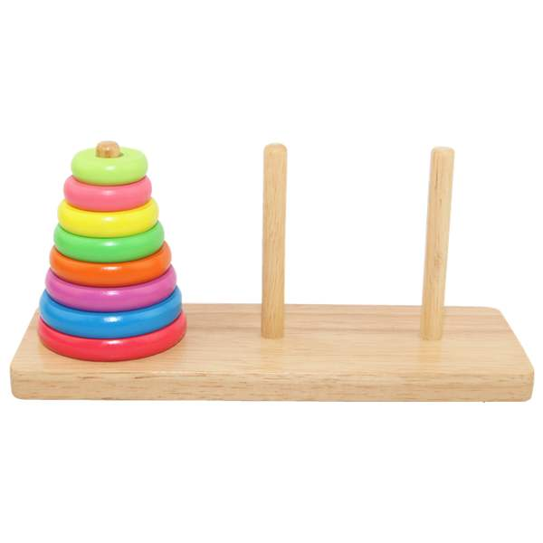

```c
#include <stdio.h>

int move = 0;       // 移动次数

/**
 * @brief  汉诺塔算法
 * @note   把 n 个盘子从 src 借助 mid 移到 dst
 * @param  n: 层数
 * @param  src: 起点柱子
 * @param  mid: 临时柱子
 * @param  dst: 目标柱子
 */
void hanoi(int n, char src, char mid, char dst) {
    if(n == 1) {
        printf("%d号盘：%c -> %c\n", n, src, dst);
        move++;
    } else {
        // 把前 n-1 个盘子从 src 借助 dst 移到 mid
        hanoi(n-1, src, dst, mid);
        // 移动第 n 个盘子
        printf("%d号盘：%c -> %c\n", n, src, dst);
        move++;
        // 把刚才的 n-1 个盘子从 mid 借助 src 移到 dst
        hanoi(n-1, mid, src, dst);
    }
}

int main() {
    hanoi(4, 'A', 'B', 'C');
    printf("步数 ==> %d\n", move);
    return 0;
}
```

> 运行结果

```
1号盘：A -> B
2号盘：A -> C
1号盘：B -> C
3号盘：A -> B
1号盘：C -> A
2号盘：C -> B
1号盘：A -> B
4号盘：A -> C
1号盘：B -> C
2号盘：B -> A
1号盘：C -> A
3号盘：B -> C
1号盘：A -> B
2号盘：A -> C
1号盘：B -> C
步数 ==> 15
```

---

<div style="page-break-after: always;"></div>

# 第7章 指针

## 7.1 指针

**指针（Pointer）**

指针是一个变量，用来保存另一个变量的地址。指针与其它变量或常量一样，在使用指针之前需使用`*`指定一个变量是指针类型。

```c
data_type *pointer_name;
```

通过取地址运算符`&`可以获取变量在内存中的地址。

---

【代码】指针

```c
#include <stdio.h>

int main() {
    int a;
    int *p = &a;

    printf("变量a的地址：%p\n", &a);
    printf("指针p保存的值：%p\n", p);
    printf("指针p的地址：%p\n", &p);
    return 0;
}
```

> 运行结果

```
变量a的地址：0060FEFC
指针p保存的值：0060FEFC
指针p的地址：0060FEF8
```

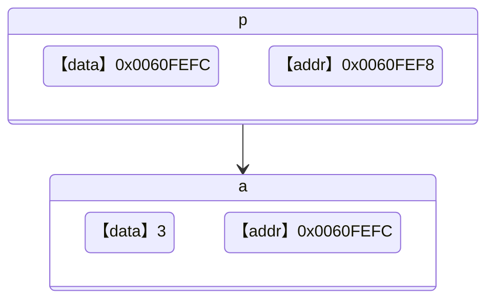

---


**取内容运算符**

取内容运算符`*`是一个单目运算符，用来访问指针所指向地址上的值。

---

【代码】通过指针修改变量的值

```c
#include <stdio.h>

int main() {
    int a = 1;
    int *p = &a;

    printf("指针p所指向的地址上的值：%d\n", *p);
    *p = 2;
    printf("指针p所指向的地址上的值：%d\n", *p);
    return 0;
}
```

> 运行结果

```
指针p所指向的地址上的值：1
指针p所指向的地址上的值：2
```

---

取地址运算符`&`与取内容运算符`*`起相反作用：

- *&p == *(&p) ==p
- &\*p == &(\*p) == p


**应用场景**

为什么要多此一举通过指针修改变量的值？

由于函数只能由一个返回值，如果当函数需要返回多个值时，某些值就只能通过指针进行返回。

---

【代码】交换两个变量的值（Bug版本）

```c
#include <stdio.h>

void swap(int num1, int num2) {
    int temp = num1;
    num1 = num2;
    num2 = temp;
}

int main() {
    int a = 11;
    int b = 22;

    printf("交换前：a = %d, b = %d\n", a, b);
    swap(a, b);
    printf("交换后：a = %d, b = %d\n", a, b);
    return 0;
}
```

> 运行结果

```
交换前：a = 11, b = 22
交换后：a = 11, b = 22
```

---

【代码】交换两个变量的值（正确版本）

```c
#include <stdio.h>

void swap(int *num1, int *num2) {
    int temp = *num1;
    *num1 = *num2;
    *num2 = temp;
}

int main() {
    int a = 11;
    int b = 22;

    printf("交换前：a = %d, b = %d\n", a, b);
    swap(&a, &b);
    printf("交换后：a = %d, b = %d\n", a, b);
    return 0;
}
```

> 运行结果

```
交换前：a = 11, b = 22
交换后：a = 22, b = 11
```

---


**野指针**

使用指针时最常见的错误就是声明了指针变量，但还没有指向任何变量，就开始使用指针。

---

【代码】野指针

```c
#include <stdio.h>

int main() {
    int *p;
    printf("%d\n", *p);
    return 0;
}
```

> 运行结果

```
warning: 'p' is used uninitialized in this function [-Wuninitialized]
```

---

在变量声明的时候，如果没有确切的地址可以赋值，为指针变量赋一个`NULL`值是一个良好的编程习惯。赋为`NULL`值的指针被称为空指针。`NULL`指针是一个定义在标准库中的值为零的常量。

```c
#define NULL 0
```

---

【代码】空指针NULL

```c
#include <stdio.h>

int main() {
    int *p = NULL;
    printf("%p\n", p);
    return 0;
}
```

> 运行结果

```
000000
```

---

<div style="page-break-after: always;"></div>

## 7.2 指针与数组

**指针与数组**

数组变量本身就表达地址，所以无需使用`&`取地址。

```c
int arr[10];
int *p = arr;
```

但是数组的每个单元表达的是变量，需要使用`&`取地址。

```c
int arr[10];
int *p = &arr[0];
```

---

【代码】指针遍历数组

```c
#include <stdio.h>

int main() {
    int arr[] = {44, 12, 64, 78, 16, 72, 13, 98, 84};
    int n = sizeof(arr) / sizeof(arr[0]);
    int *p = arr;

    while(p < arr + n) {
        printf("%d ", *p);
        p++;
    }
    printf("\n");
    return 0;
}
```

> 运行结果

```
44 12 64 78 16 72 13 98 84
```

---


**数组与函数**

在将数组作为函数参数传递的时候，在函数参数列表中的数组实际上是一个指向数组首地址的指针。

以下两种函数声明是等价的：

```c
int func(int *arr);
int func(int arr[]);
```

---

【代码】查找数组最大值

```c
#include <stdio.h>

int getMax(int *arr, int n) {
    int max = arr[0];
    for(int i = 1; i < n; i++) {
        if(arr[i] > max) {
            max = arr[i];
        }
    }
    return max;
}

int main() {
    int arr[] = {76, 23, 12, 98, 5, 61, 30};
    int n = sizeof(arr) / sizeof(arr[0]);
    int max = getMax(arr, n);
    printf("max = %d\n" , max);
    return 0;
}
```

> 运行结果

```
max = 98
```

---

<div style="page-break-after: always;"></div>

## 7.3 指针与字符串

**指针与字符串**

指针还可以指向一个字符串常量，但是试图通过指针所指的字符串做`写`操作会导致程序崩溃。

---

【代码】修改字符串常量

```c
#include <stdio.h>

int main() {
    char *s = "hello";
    s[0] = 'H';
    printf("%s\n", s);
    return 0;
}
```

> 运行结果

```
出现了一个问题，导致程序停止正常工作。请关闭该程序。
```

---

因此，如果需要对字符串进行修改，应该用字符数组的形式。

---

【代码】修改字符串

```c
#include <stdio.h>

int main() {
    char s[] = "hello";
    s[0] = 'H';
    printf("%s\n", s);
    return 0;
}
```

> 运行结果

```
Hello
```

---

在对一个指向字符串的指针进行赋值操作的时候，并没有产生新的字符串，只是让两个指针都指向该字符串，对其中任意一个指针做的操作都会对另一个指针产生影响。

---

【代码】指向字符串的指针

```c
#include <stdio.h>

int main() {
    char str[] = "hello";
    char *s = str;
    char *t;

    t = s;
    s[0] = 'H';

    printf("指针s指向的字符串：%s\n", s);
    printf("指针t指向的字符串：%s\n", t);
    printf("指针s的地址：%p\n", &s);
    printf("指针t的地址：%p\n", &t);
    return 0;
}
```

> 运行结果

```
指针s指向的字符串：Hello
指针t指向的字符串：Hello
指针s的地址：0022FE40
指针t的地址：0022FE38
```

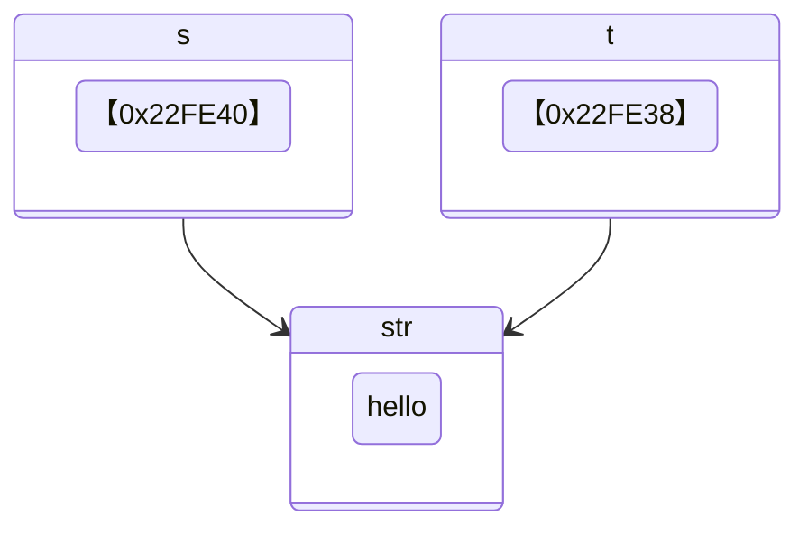

---

<div style="page-break-after: always;"></div>

## 7.4 动态内存申请

**malloc()**

`C99`支持声明数组时使用变量作为数组的大小。

```c
int n = 50;
int arr[n];
```

但是在`C99`之前的版本中，需要使用动态内存申请的方式进行数组空间的开辟。`malloc()`的功能是向系统申请指定的内存空间（以字节为单位），使用该函数需要包含头文件`stdlib.h`。

`malloc()`函数原型为：

```c
void* malloc(size_t size);
```

`malloc()`的返回值为`void *`类型，表示一个指向申请到的空间的首地址，是一个无类型的指针，开发者需要自行转换为自己需要的类型。如果`malloc()`申请内存失败，则会返回空指针`NULL`。

```c
data_type *ptr = (data_type *)malloc(sizeof(data_type) * size);
```

---

【代码】耗尽所有可申请到的内存空间

```c
#include <stdio.h>
#include <stdlib.h>

int main() {
    void *p;
    int cnt = 0;

    // 每次申请100MB的空间
    while((p = malloc(100 * 1024 * 1024))) {
        cnt++;
    }
    printf("一共分配了%dMB空间\n", cnt*100);
    return 0;
}
```

> 运行结果

```
一共分配了1900MB空间
```

---

通过`malloc()`申请来的空间是需要归还给操作系统的，否则程序长时间运行内存会逐渐下降。

通过`free()`可以把申请来的空间释放，但是有两点需要注意：

1. 只能释放通过`malloc()`申请得到的空间
2. 只能通过空间的首地址进行释放


---

【代码】动态申请内存空间

```c
#include <stdio.h>
#include <stdlib.h>

int main() {
    int n;
    printf("班级人数：");
    scanf("%d", &n);

    int *scores = (int *)malloc(sizeof(int) * n);
    if(!scores) {
        fprintf(stderr, "内存申请失败\n");
        exit(1);
    }

    int total = 0;
    for(int i = 0; i < n; i++) {
        printf("第%d个学生成绩：", i+1);
        scanf("%d", &scores[i]);
        total += scores[i];
    }

    printf("平均分：%.2f\n", 1.0 * total / n);
    free(scores);
    return 0;
}
```

> 运行结果

```
班级人数：5
第1个学生成绩：67
第2个学生成绩：98
第3个学生成绩：100
第4个学生成绩：53
第5个学生成绩：65
平均分：76.60
```

---

在函数中的定义的字符数组是局部变量，其作用域和生命周期仅在函数内有效，如果将其作为函数返回值返回，在函数外部无法访问到该变量的内容。

---

【代码】函数返回字符串（Bug版本）

```c
#include <stdio.h>
#include <stdlib.h>
#include <string.h>

/**
 * @brief  生成一段自我介绍
 * @param  name: 姓名
 * @param  age: 年龄
 * @retval 指定格式字符串：大家好，我叫{name}，今年{age}岁。
 */
char* generateInfo(char *name, int age) {
    char info[128] = "大家好，我叫";
    char age_str[8] = "";
    strcat(info, name);
    strcat(info, "，今年");
    // itoa()函数用于将整数转为字符串
    // 把age以10进制转换为字符串保存到age_str
    strcat(info, itoa(age, age_str, 10));
    strcat(info, "岁。");
    return info;
}

int main() {
    printf("%s\n", generateInfo("极夜酱", 17));
    return 0;
}
```

> 运行结果

```
warning: function returns address of local variable [-Wreturn-local-addr]
```

---

【代码】函数返回字符串（正确版本）

```c
#include <stdio.h>
#include <stdlib.h>
#include <string.h>

/**
 * @brief  生成一段自我介绍
 * @param  name: 姓名
 * @param  age: 年龄
 * @retval 指定格式字符串：大家好，我叫{name}，今年{age}岁。
 */
char* generateInfo(char *name, int age) {
    char *info = (char *)malloc(sizeof(char) * 128);
    if(!info) {
        return NULL;
    }
    char age_str[8] = "";
    strcpy(info, "大家好，我叫");
    strcat(info, name);
    strcat(info, "，今年");
    // itoa()函数用于将整数转为字符串
    // 把age以10进制转换为字符串保存到age_str
    strcat(info, itoa(age, age_str, 10));
    strcat(info, "岁。");
    return info;
}

int main() {
    printf("%s\n", generateInfo("极夜酱", 17));
    return 0;
}
```

> 运行结果

```
大家好，我叫极夜酱，今年17岁。
```

---

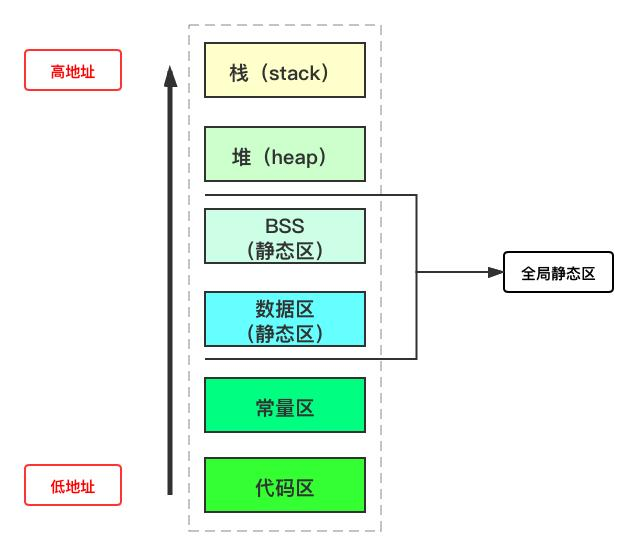

<div style="page-break-after: always;"></div>

# 第8章 文件

## 8.1 文件打开方式

**文件**

C语言具有操作文件的能力，比如对文件数据的添加、删除、修改等。为了统一对各种硬件的操作，不同的硬件设备也都被看作是文件进行管理。计算机中键盘是标准输入设备`stdin`，显示器是标准输出设备`stdout`。

C语言通过声明一个文件`FILE`类型的指针，可以对指针所指向的文件进行操作。

```c
FILE *fp;
```


**文件打开**

`fopen()`用于打开文件，函数原型为：

```c
FILE *fopen(const char *fname, const char *mode);
```

> - fname：需要被打开的文件名路径
>- mode：打开方式

| 打开方式 | 描述                                                         |
| :------: | :----------------------------------------------------------- |
|    r     | 以`只读`模式打开文本文件。文件必须存在，否则打开失败         |
|    w     | 以`只写`模式打开文本文件。如果文件不存在，则创建一个文件；如果文件存在，则情况文件内容 |
|    a     | 以`追加`模式打开文本文件。如果文件不存在，则创建一个文件；如果文件存在，则将写入的数据追加到文件末尾 |
|    r+    | 以`读+写`模式打开文件文件。文件必须存在，否则打开失败        |
|    w+    | 以`写+读`模式打开文件文件。如果文件不存在，则创建一个文件；如果文件存在，则清空文件内容 |
|    a+    | 以`追加+读`模式打开文件文件。如果文件不存在，则创建一个文件；如果文件存在，则将写入的数据追加到文件末尾 |
|    rb    | 以`只读`模式打开二进制文件                                   |
|    wb    | 以`只写`模式打开二进制文件                                   |
|    ab    | 以`追加`模式打开二进制文件                                   |
|   rb+    | 以`读+写`模式打开二进制文件                                  |
|   wb+    | 以`写+读`模式打开二进制文件                                  |
|   ab+    | 以`追加+读`模式打开二进制文件                                |

如果文件打开失败，`fopen()`则会返回空指针`NULL`。


**文件关闭**

在对文件操作结束后，需要使用`fclose()`将文件关闭。

```c
fclose(fp);
```

`fclose()`负责清空缓冲区，并释放文件指针。需要特别注意的是，在对文件执行写操作以后，并不会马上写入文件，而只是写入到了这个文件的输出缓冲区中。只有当输出缓冲区满了，或者执行了`fflush()`，或者执行了`fclose()`以后，或者程序结束，才会把输出缓冲区中的内容写入文件。

---

【代码】文件

```c
#include <stdio.h>
#include <stdlib.h>

int main() {
    FILE *fp = fopen("data.txt", "r");
    if(!fp) {
        fprintf(stderr, "File Open Failed\n");
        exit(1);
    }
    fclose(fp);
    return 0;
}
```

---

<div style="page-break-after: always;"></div>

## 8.2 文件读写

**fgetc()读字符**

`fgetc()`的功能是从文件读取一个字符。成功时，返回读到的字符（int类型）；失败或读到文件尾，返回`EOF（-1）`。

`fgetc()`函数原型：

```c
int fgetc(FILE *stream);
```

---

【代码】读取并输出指定文件内容

```c
#include <stdio.h>
#include <stdlib.h>

int main() {
    FILE *fp = fopen("data.txt", "r");
    if(!fp) {
        fprintf(stderr, "File Open Failed\n");
        exit(1);
    }

    char c;
    while((c = fgetc(fp)) != EOF) {
        printf("%c", c);
    }
    
    fclose(fp);
    return 0;
}
```

---

【代码】统计程序源代码的字符数和行数

```c
#include <stdio.h>
#include <stdlib.h>

int main() {
    FILE *fp = fopen("count_chars_and_lines.c", "r");
    if(!fp) {
        fprintf(stderr, "File Open Failed\n");
        exit(1);
    }

    char c;
    int charNum = 0;        // 字符数量
    int lineNum = 0;        // 行数

    while((c = fgetc(fp)) != EOF) {
        if(c == '\n') {
            lineNum++;
        } else {
            charNum++;
        }
    }

    printf("字符数：%d\n", charNum);
    printf("行  数：%d\n", lineNum);

    fclose(fp);
    return 0;
}
```

> 运行结果

```
字符数：513
行  数：27
```

---


**fputc()写字符**

`fputc()`的功能是将一个字符写入文件中。

`fputc()`函数原型：

```c
int fputc(int ch, FILE *stream);
```

---

【代码】将程序源代码输出到指定文件

```c
#include <stdio.h>
#include <stdlib.h>

int main() {
    FILE *fp1 = fopen("fputc.c", "r");
    FILE *fp2 = fopen("data.txt", "w");
    if(!fp1) {
        fprintf(stderr, "File Open Failed\n");
        exit(1);
    }

    char c;
    while((c = fgetc(fp1)) != EOF) {
        fputc(c, fp2);
    }

    fclose(fp1);
    fclose(fp2);
    return 0;
}
```

---


**fgets()读字符串**

`fgets()`的功能是从文件读取一个字符串。读取成功时，返回指向字符串的指针；读取失败时，返回`NULL`。

`fgets()`函数原型：

```c
char *fgets(char *str, int num, FILE *stream);
```

> - str：用于保存字符串的变量
>- num：最多读取字符数量，由于字符串结尾需要保留`\0`结束符，因此真正只能最多读取num-1个字符

---

【代码】读取并输出程序源代码内容

```c
#include <stdio.h>
#include <stdlib.h>

int main() {
    FILE *fp = fopen("fgets.c", "r");
    if(!fp) {
        fprintf(stderr, "File Open Failed\n");
        exit(1);
    }

    char line[128];
    while(fgets(line, sizeof(line), fp)) {
        printf("%s", line);
    }

    fclose(fp);
    return 0;
}
```

---


**fputs()写字符串**

`fputs()`的功能是将一个字符串写入文件中。

`fputs()`函数原型：

```c
int fputs(const char *str, FILE *stream);
```

---

【代码】将程序源代码输出到指定文件

```c
#include <stdio.h>
#include <stdlib.h>

int main() {
    FILE *fp1 = fopen("fputs.c", "r");
    FILE *fp2 = fopen("data.txt", "w");
    if(!fp1) {
        fprintf(stderr, "File Open Failed\n");
        exit(1);
    }

    char line[128];
    while(fgets(line, sizeof(line), fp1)) {
        fputs(line, fp2);
    }

    fclose(fp1);
    fclose(fp2);
    return 0;
}
```

---


**fprintf()格式化输出**

`fprintf()`使用方法与`printf()`类似，只是多增加了一个参数，用于指定输出流。

`fprintf()`函数原型：

```c
int fprintf(FILE *stream, const char *format, ...);
```

---

【代码】将数据格式化输出到指定文件

```c
#include <stdio.h>
#include <stdlib.h>

int main() {
    FILE *fp = fopen("data.txt", "w");
    char name[3][12] = {"极夜酱", "小灰", "小白"};
    int age[3] = {17, 22, 19};

    for(int i = 0; i < 3; i++) {
        fprintf(fp, "%s\t%d\n", name[i], age[i]);
    }
    
    fclose(fp);
    return 0;
}
```

> 【data.txt】文件内容

```
极夜酱	17
小灰	22
小白	19
```

---


**fscanf()格式化输入**

`fscanf()`的功能是按照指定格式从文件读取数据。读取成功时返回实际读取的数据个数，失败时返回`EOF`。

`fscanf()`函数原型：

```c
int fscanf(FILE *stream, const char *format, ...);
```

---

【代码】从指定文件读取指定格式数据

```c
#include <stdio.h>
#include <stdlib.h>

int main() {
    FILE *fp = fopen("data.txt", "r");
    if(!fp) {
        fprintf(stderr, "File Open Failed\n");
        exit(1);
    }
    
    char name[12];
    int age;
    
    while(fscanf(fp, "%s\t%d", name, &age) != EOF) {
        printf("%s\t%d\n", name, age);
    }

    fclose(fp);
    return 0;
}
```

> 运行结果

```
极夜酱  17
小灰   22
小白   19
```

---


**feof()检查文件结束**

`feof()`的功能是检查文件是否已经达到文件末尾位置，如果是就返回非零值（真）。

`feof()`函数原型：

```c
int feof(FILE *stream);
```

---

【代码】从通讯录文件中查找指定人名

```c
#include <stdio.h>
#include <stdlib.h>
#include <string.h>
#include <stdbool.h>

int main() {
    FILE *fp = fopen("data.txt", "r");
    if(!fp) {
        fprintf(stderr, "File Open Failed\n");
        exit(1);
    }

    char key[32];       // 需查找数据
    char name[32];
    int age;
    bool found = false; // 是否找到

    printf("查找姓名：");
    gets(key);

    while(!feof(fp)) {
        fscanf(fp, "%s\t%d", name, &age);
        if(strcmp(name, key) == 0) {
            printf("%s\t%d\n", name, age);
            found = true;
            break;
        }
    }

    if(!found) {
        printf("未找到【%s】的信息\n", key);
    }

    fclose(fp);
    return 0;
}
```

> 运行结果

```
查找姓名：小灰
小灰	22
```

---

<div style="page-break-after: always;"></div>

# 第9章 结构体

## 9.1 结构体

**结构体（Structure）**

C语言中，数组是一种允许存储多个相同类型数据项的结构。结构体是另一种用户自定义的数据类型，它允许存储不同类型的数据项。

结构体的声明可以使用关键字`struct`，结构体名一般首字母大写。结构体的声明以`;`结束。结构体的声明通常定义为全局变量，这样就可以被多个函数所使用的了。

```c
struct struct_name {
    data_type var_name1;
    data_type var_name2;
    ...
};
```

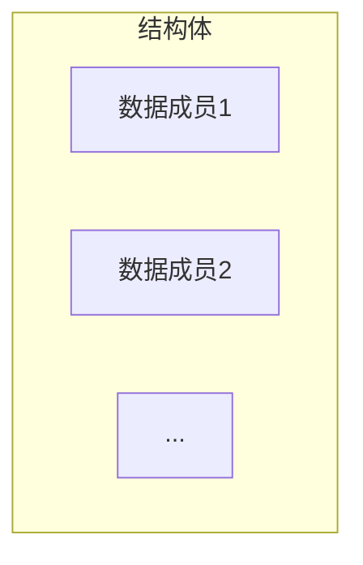

通常会将用于描述同一个事物的变量定义成结构体。

例如：

- 日期（年、月、日）
- 坐标（横坐标、纵坐标）
- 学生信息（姓名、年龄、学号、成绩）

定义结构体变量时，不能只使用结构体名，需要加上`struct`关键字。

通过成员运算符`.`可以访问一个结构体之中的成员变量。

---

【代码】结构体变量

```c
#include <stdio.h>

struct Date {
    int year;
    int month;
    int day;
};

int main() {
    struct Date date;
    date.year = 2021;
    date.month = 3;
    date.day = 12;

    printf("%d年%d月%d日\n", date.year, date.month, date.day);
    return 0;
}
```

> 运行结果

```
2021年3月12日
```

---

<div style="page-break-after: always;"></div>

## 9.2 typedef

**typedef**

关键字`typedef`可以用来给数据类型定义别名，通过使用`typedef`可以简化结构体的声明，不用每次都加上`struct`关键字了。

```c
typedef struct [struct_name] {
    data_type var_name1;
    data_type var_name2;
    ...
} struct_name;
```

---

【代码】typedef定义别名

```c
#include <stdio.h>

typedef struct Coordinate {
    double x;
    double y;
} Coordinate;

int main() {
    Coordinate coor;
    coor.x = 3.1;
    coor.y = 2.7;
    printf("(%.1f, %.1f)\n", coor.x, coor.y);
    return 0;
}
```

> 运行结果

```
(3.1, 2.7)
```

---

<div style="page-break-after: always;"></div>

## 9.3 结构体指针

**结构体指针**

与数组不同，结构体变量的名字并不是结构体变量的地址，必须使用取地址运算符`&`。

结构体也可以作为函数参数进行传递。如果是按值传递，那么在函数中会新创建一个结构体变量，并复制调用者的结构体的值。如果是按址传递，则需要传递结构体的指针。

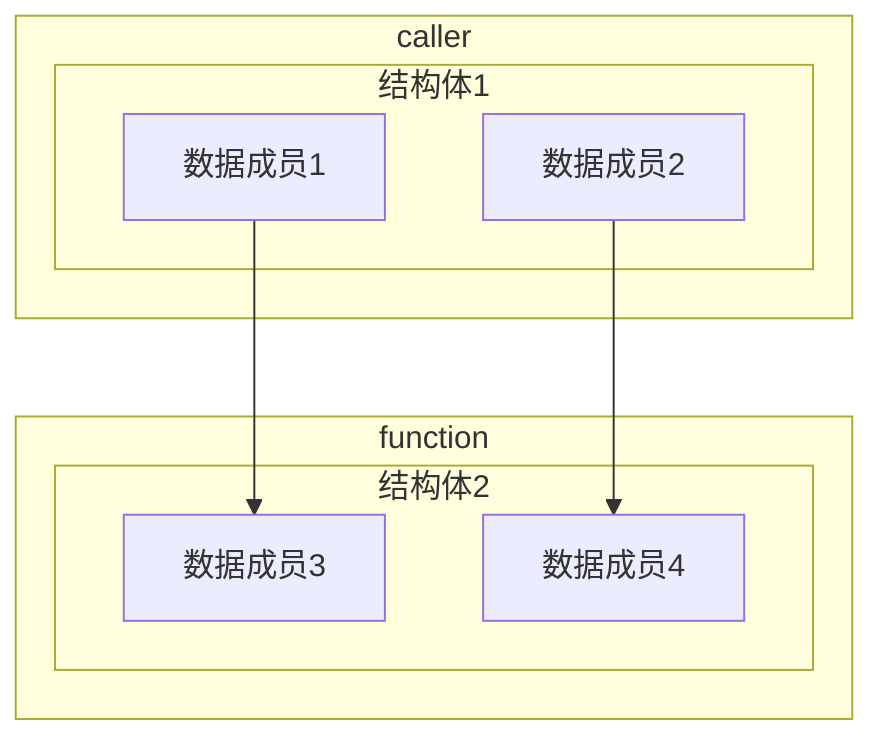

C语言提供了一个间接引用运算符`->`，可以直接访问结构体指针所指的结构变量中的成员。

---

【代码】倒数

```c
#include <stdio.h>
#include <stdlib.h>

// 分数
typedef struct Fraction {
    int numerator;       // 分子
    int denominator;     // 分母
} Fraction;

/**
 * @brief  倒数
 * @note   分母不能为0
 * @param  f: 分数结构体
 * @retval None
 */
void reciprocal(Fraction *f) {
    if(f->numerator == 0) {
        fprintf(stderr, "无法计算倒数\n");
    } else {
        int temp = f->numerator;
        f->numerator = f->denominator;
        f->denominator = temp;
    }
}

int main() {
    Fraction fraction = {2, 5};        // 2/5
    printf("%d/%d的倒数是", fraction.numerator, fraction.denominator);
    reciprocal(&fraction);
    printf("%d/%d\n", fraction.numerator, fraction.denominator);
    return 0;
}
```

> 运行结果

```
2/5的倒数是5/2
```

---

